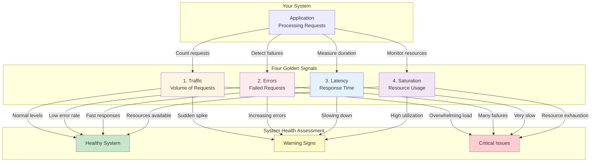
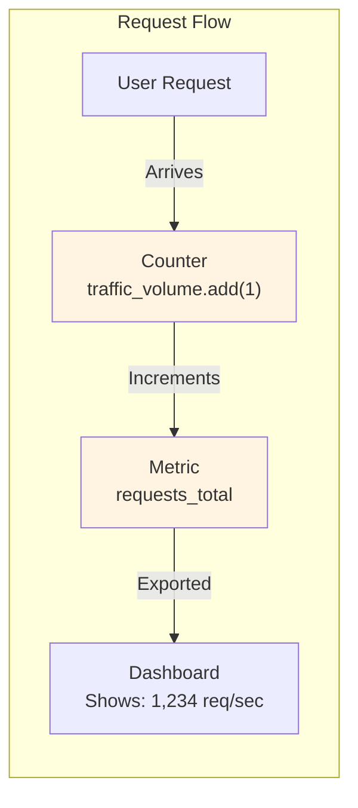
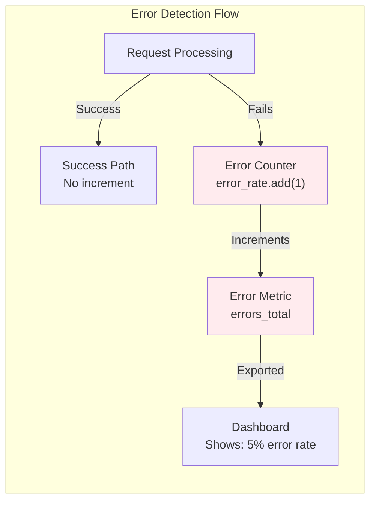
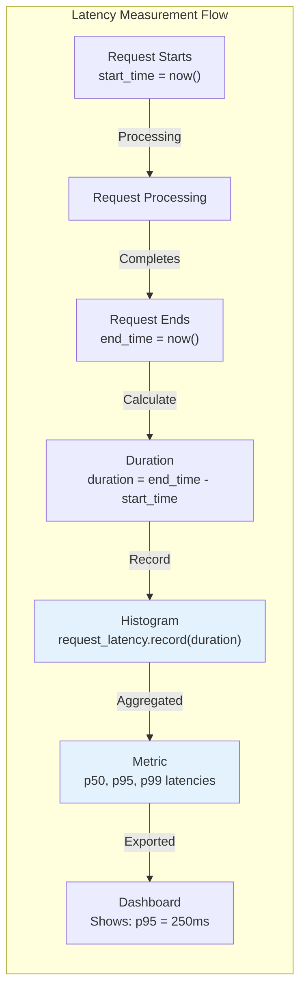
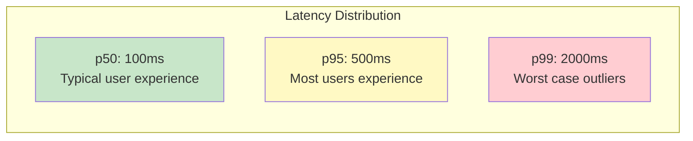
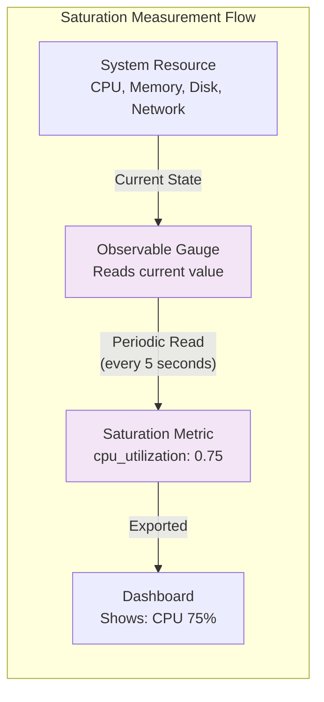
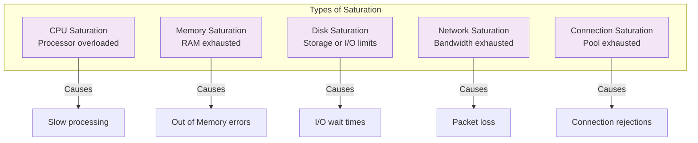
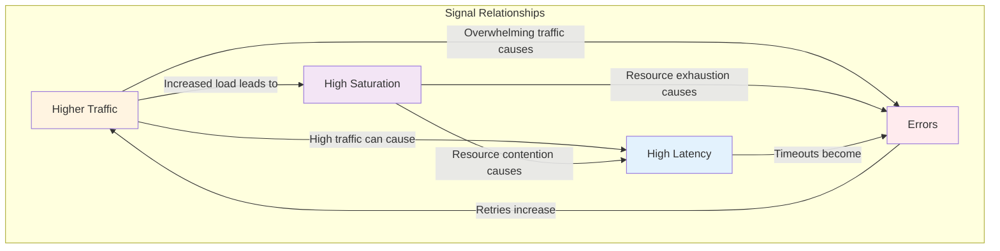

# Metrics Architecture: The Four Golden Signals of Observability

> **Overview**: This document explains the Four Golden Signals of Observability - Traffic, Errors, Latency, and Saturation - in a beginner-friendly, intuitive way. Learn why they're called "golden", how they're measured, and how they help you understand your system's health.

## Introduction

When monitoring a system, you could track hundreds of different metrics. But which ones actually matter? The **Four Golden Signals** are four key metrics that provide maximum insight into your system's health with minimal complexity. Originally defined in Google's SRE book ([Monitoring Distributed Systems](https://sre.google/sre-book/monitoring-distributed-systems/#xref_monitoring_golden-signals)), these signals answer the most critical questions:

- Is my system busy?
- Is my system working correctly?
- Is my system fast enough?
- Is my system running out of capacity?

Think of them like vital signs for your system - just as doctors check your pulse, blood pressure, temperature, and breathing to assess your health, these four signals tell you everything you need to know about your system's health.

## Why Are They Called "Golden"?

The term "golden" comes from the idea that these signals are **exceptionally valuable** - like gold. Here's why:

### Maximum Insight, Minimal Complexity

You could track dozens of metrics, but these four provide **80% of the value** with just **20% of the effort**. They're the Pareto Principle in action - a small number of metrics that give you the biggest picture of system health.

### Universal Applicability

These signals work for **any type of system**:
- Web applications
- APIs and microservices
- Databases
- Message queues
- Infrastructure components

No matter what you're monitoring, these four signals apply.

### Actionable

Unlike some metrics that are just "nice to know," these signals are **actionable**. When they show problems, you know exactly what to investigate:
- High traffic → Scale up or optimize
- High errors → Debug and fix bugs
- High latency → Optimize performance
- High saturation → Add resources or reduce load

### Answer Critical Questions

They answer the questions that matter most:
- **Traffic**: "How busy is my system?" (Volume of work)
- **Errors**: "Is my system working correctly?" (Quality of work)
- **Latency**: "Is my system fast enough?" (Speed of work)
- **Saturation**: "Is my system running out of capacity?" (Resource availability)

## Visual Overview: The Four Golden Signals



## The Four Signals Explained

### 1. Traffic: How Busy Is Your System?

**What It Measures**: The volume of requests or work your system is handling.

**Real-World Analogy**: Think of a restaurant during dinner rush. Traffic is like counting how many customers walk through the door. Are you serving 10 customers per hour or 1000?

**Why It Matters**: 
- **Too Low**: Your system might be underutilized (wasting resources) or there's a problem preventing users from reaching it
- **Too High**: Your system might be overwhelmed, leading to slowdowns or failures
- **Sudden Changes**: A spike might indicate a DDoS attack, viral content, or a bug causing retries

**How It's Measured**:

Traffic is measured using a **Counter** instrument that increments every time a request arrives:

```89:94:exercises/manual-instrumentation-metrics/solution/src/metric_utils.py
def create_request_instruments(meter: metrics.Meter) -> dict[str, Any]:
    traffic_volume = meter.create_counter(
        name="traffic_volume",
        unit="request",
        description="total volume of requests to an endpoint",
    )
```

**Visual Flow**:



**Common Units**:
- Requests per second (req/sec)
- Requests per minute (req/min)
- Total requests (count)

**What to Watch For**:
- ✅ **Normal**: Steady, predictable traffic patterns
- ⚠️ **Warning**: Sudden spikes (2x or more increase)
- 🚨 **Critical**: Traffic overwhelming system capacity

**Example Scenarios**:
- **E-commerce site**: Traffic spikes during Black Friday sales
- **API service**: Traffic increases when a mobile app goes viral
- **Database**: Query volume increases during report generation

---

### 2. Errors: Is Your System Working Correctly?

**What It Measures**: The rate of failed requests or operations.

**Real-World Analogy**: In a restaurant, errors are like orders that come back wrong or can't be fulfilled. If 1 out of 100 orders has a problem, that's manageable. If 50 out of 100 orders fail, you have a serious issue!

**Why It Matters**:
- **User Experience**: Errors directly impact user satisfaction
- **System Health**: High error rates indicate bugs, misconfigurations, or resource problems
- **Business Impact**: Errors can mean lost revenue, frustrated users, or data corruption

**How It's Measured**:

Errors are measured using a **Counter** instrument that increments when a request fails:

```96:98:exercises/manual-instrumentation-metrics/solution/src/metric_utils.py
    error_rate = meter.create_counter(
        name="error_rate", unit="request", description="rate of failed requests"
    )
```

**Visual Flow**:



**Common Units**:
- Error rate (errors per second)
- Error percentage (% of requests that fail)
- Total errors (count)

**Error Rate Calculation**:
```
Error Rate = (Number of Errors / Total Requests) × 100%
```

**What to Watch For**:
- ✅ **Normal**: Less than 0.1% error rate (1 error per 1000 requests)
- ⚠️ **Warning**: 1-5% error rate (investigate immediately)
- 🚨 **Critical**: More than 5% error rate (system is failing)

**Common Error Types**:
- **4xx Errors** (Client errors): Bad requests, authentication failures
- **5xx Errors** (Server errors): Internal server errors, service unavailable
- **Timeouts**: Requests that take too long and are abandoned
- **Exceptions**: Unhandled exceptions in application code

**Example Scenarios**:
- **API**: 500 errors spike when database connection pool is exhausted
- **Web app**: 404 errors increase when a popular page URL changes
- **Microservice**: Errors spike when a downstream service is down

---

### 3. Latency: Is Your System Fast Enough?

**What It Measures**: The amount of time it takes to serve a request or complete an operation.

**Real-World Analogy**: Latency is like waiting in line at a coffee shop. If you wait 30 seconds, that's fine. If you wait 5 minutes, you'll probably leave. Similarly, users expect fast responses - if your API takes 5 seconds to respond, users will abandon it.

**Why It Matters**:
- **User Experience**: Slow systems frustrate users and drive them away
- **Business Impact**: Every 100ms of latency can reduce conversions by 1%
- **System Health**: High latency often indicates underlying problems (resource contention, inefficient code, network issues)

**How It's Measured**:

Latency is measured using a **Histogram** instrument that records the duration of each request:

```100:105:exercises/manual-instrumentation-metrics/solution/src/metric_utils.py
    # https://github.com/open-telemetry/semantic-conventions/blob/main/docs/http/http-metrics.md#metric-httpserverrequestduration
    request_latency = meter.create_histogram(
        name="http.server.request.duration",
        unit="s",
        description="latency for a request to be served",
    )
```

**Visual Flow**:



**Common Units**:
- Milliseconds (ms) - most common for web requests
- Seconds (s) - for longer operations
- Microseconds (μs) - for very fast operations

**Latency Percentiles**:

Latency is typically measured using percentiles:
- **p50 (Median)**: Half of requests are faster, half are slower
- **p95**: 95% of requests are faster than this
- **p99**: 99% of requests are faster than this (catches outliers)

**Why Percentiles Matter**:



**What to Watch For**:
- ✅ **Normal**: p95 latency under 200ms for web APIs
- ⚠️ **Warning**: p95 latency over 500ms (users notice slowness)
- 🚨 **Critical**: p95 latency over 1 second (users abandon requests)

**Example Scenarios**:
- **API**: Latency increases when database queries slow down
- **Web page**: Page load time increases when images are too large
- **Microservice**: Latency spikes when calling a slow downstream service

---

### 4. Saturation: Is Your System Running Out of Capacity?

**What It Measures**: How much of a resource is being consumed at a given time.

**Real-World Analogy**: Saturation is like checking how full a parking garage is. At 50% capacity, there's plenty of space. At 95% capacity, you're almost full and might need to turn cars away. At 100%, you're completely saturated and can't accept any more.

**Why It Matters**:
- **Capacity Planning**: Helps predict when you'll need more resources
- **Performance**: High saturation leads to slowdowns and errors
- **Cost Optimization**: Understanding saturation helps right-size resources
- **Prevents Failures**: Catching high saturation before it reaches 100% prevents outages

**How It's Measured**:

Saturation is measured using **Observable Gauge** instruments that read current resource usage:

```116:131:exercises/manual-instrumentation-metrics/solution/src/metric_utils.py
# units https://opentelemetry.io/docs/specs/semconv/general/metrics/#instrument-units
def create_resource_instruments(meter: metrics.Meter) -> dict[str, Any]:
    cpu_util_gauge = meter.create_observable_gauge(
        name="process.cpu.utilization",
        callbacks=[
            lambda x: [metrics.Observation(psutil.cpu_percent(interval=1) / 100)]
        ],
        unit="1",
        description="CPU utilization",
    )

    memory_usage_gauge = meter.create_observable_up_down_counter(
        name="process.memory.usage",
        callbacks=[lambda x: [metrics.Observation(psutil.virtual_memory().used)],
        unit="By",
        description="total amount of memory used",
    )
```

**Visual Flow**:



**Common Resources to Monitor**:
- **CPU**: Processor utilization (0-100%)
- **Memory**: RAM usage (bytes or percentage)
- **Disk**: Disk space and I/O (bytes, IOPS)
- **Network**: Bandwidth usage (bytes/sec)
- **Threads**: Number of active threads
- **Connections**: Database connections, HTTP connections

**Common Units**:
- Percentage (0-100%) - for utilization
- Bytes (B, KB, MB, GB) - for memory/disk
- Operations per second - for I/O operations

**What to Watch For**:
- ✅ **Normal**: Under 70% utilization (healthy headroom)
- ⚠️ **Warning**: 70-90% utilization (approaching limits)
- 🚨 **Critical**: Over 90% utilization (risk of saturation)

**Saturation Types**:



**Example Scenarios**:
- **CPU**: High CPU saturation during video encoding jobs
- **Memory**: Memory saturation when processing large datasets
- **Disk**: Disk I/O saturation during database backups
- **Network**: Network saturation during large file transfers
- **Connections**: Database connection pool saturation during traffic spikes

---

## How the Signals Work Together

The Four Golden Signals don't work in isolation - they're interconnected. Understanding their relationships helps you diagnose problems faster.

### Signal Relationships



### Common Problem Patterns

**Pattern 1: Traffic Spike**
```
High Traffic → High Saturation → High Latency → High Errors
```
*Example: Black Friday sale causes traffic spike, servers get saturated, responses slow down, and errors increase*

**Pattern 2: Resource Exhaustion**
```
High Saturation → High Latency → High Errors → More Retries → Higher Traffic
```
*Example: Database connection pool exhausted, queries slow down, timeouts occur, clients retry, increasing load*

**Pattern 3: Cascading Failure**
```
High Errors → Retries → Higher Traffic → Higher Saturation → More Errors
```
*Example: One service fails, clients retry, increasing load on remaining services, causing them to fail too*

## Measurement Best Practices

### 1. Measure at the Right Level

Measure signals at the **service level** and **endpoint level**:
- Service-level metrics give you the big picture
- Endpoint-level metrics help you pinpoint problems

### 2. Use Appropriate Instruments

Based on the [Metrics Architecture documentation](metricsArchitecture.md#choosing-the-right-instrument):

- **Traffic**: Use **Counter** (synchronous) - increments on each request
- **Errors**: Use **Counter** (synchronous) - increments on each error
- **Latency**: Use **Histogram** (synchronous) - records duration distribution
- **Saturation**: Use **Observable Gauge** (asynchronous) - reads current resource state

### 3. Set Meaningful Thresholds

Define alert thresholds based on your SLOs (Service Level Objectives):
- **Traffic**: Alert on sudden spikes (>2x normal)
- **Errors**: Alert when error rate > 0.1%
- **Latency**: Alert when p95 > 500ms
- **Saturation**: Alert when utilization > 80%

### 4. Track Trends, Not Just Current Values

A single high value might be a blip. Watch for:
- **Sudden changes**: Rapid increases or decreases
- **Trends**: Gradual increases over time
- **Patterns**: Time-of-day or day-of-week patterns

### 5. Correlate Signals

Don't look at signals in isolation:
- High latency + high saturation = resource problem
- High errors + high traffic = overload problem
- High latency + normal saturation = code/query optimization needed

## Real-World Example: E-Commerce API

Let's see how the Four Golden Signals work together in a real scenario:

### Normal Operation

```
Traffic:    500 req/sec (normal)
Errors:     0.05% error rate (excellent)
Latency:    p95 = 150ms (fast)
Saturation: CPU 45%, Memory 60% (healthy)
```

**Status**: ✅ System is healthy

### Traffic Spike (Flash Sale)

```
Traffic:    5,000 req/sec (10x increase!)
Errors:     2% error rate (increasing)
Latency:    p95 = 800ms (slowing down)
Saturation: CPU 85%, Memory 90% (approaching limits)
```

**Analysis**: 
- Traffic spike is causing saturation
- High saturation is causing latency
- Some requests are timing out (errors)

**Action**: Scale up servers or enable rate limiting

### After Scaling

```
Traffic:    5,000 req/sec (still high)
Errors:     0.1% error rate (back to normal)
Latency:    p95 = 200ms (acceptable)
Saturation: CPU 65%, Memory 70% (manageable)
```

**Status**: ✅ System handled the spike successfully

## Implementation in OpenTelemetry

The Four Golden Signals map directly to OpenTelemetry instruments. See the [Metrics Architecture documentation](metricsArchitecture.md) for detailed implementation patterns.

### Quick Reference

| Signal | Instrument Type | Example Code |
|--------|----------------|--------------|
| **Traffic** | Counter | `meter.create_counter("traffic_volume")` |
| **Errors** | Counter | `meter.create_counter("error_rate")` |
| **Latency** | Histogram | `meter.create_histogram("http.server.request.duration")` |
| **Saturation** | Observable Gauge | `meter.create_observable_gauge("process.cpu.utilization")` |

For complete implementation examples, see:
- [`exercises/manual-instrumentation-metrics/solution/src/metric_utils.py`](../../exercises/manual-instrumentation-metrics/solution/src/metric_utils.py)

## Key Takeaways

1. **Four Signals, Maximum Insight**: These four metrics provide the most valuable information about system health with minimal complexity

2. **Universal Applicability**: They work for any type of system - web apps, APIs, databases, infrastructure

3. **Actionable**: Each signal tells you exactly what to investigate when problems occur

4. **Interconnected**: Signals work together - understanding their relationships helps diagnose problems faster

5. **Measurable**: Each signal maps to specific OpenTelemetry instruments that are easy to implement

6. **Beginner-Friendly**: Start with these four signals before diving into more complex metrics

## Next Steps

- Learn how to implement these signals: [Metrics Architecture: Producing Telemetry](metricsArchitecture.md)
- Understand instrument types: [Choosing the Right Instrument](metricsArchitecture.md#choosing-the-right-instrument)
- See real-world examples: [Practical Examples](metricsArchitecture.md#practical-examples)
- Practice implementation: [`exercises/manual-instrumentation-metrics/`](../../exercises/manual-instrumentation-metrics/)

## References

- **Google SRE Book - Monitoring Distributed Systems**: [The Four Golden Signals](https://sre.google/sre-book/monitoring-distributed-systems/#xref_monitoring_golden-signals) - The original source defining Traffic, Errors, Latency, and Saturation as the four key metrics for monitoring distributed systems.

---

**Remember**: The Four Golden Signals are your starting point for observability. Master these four, and you'll have a solid foundation for understanding any system's health.

