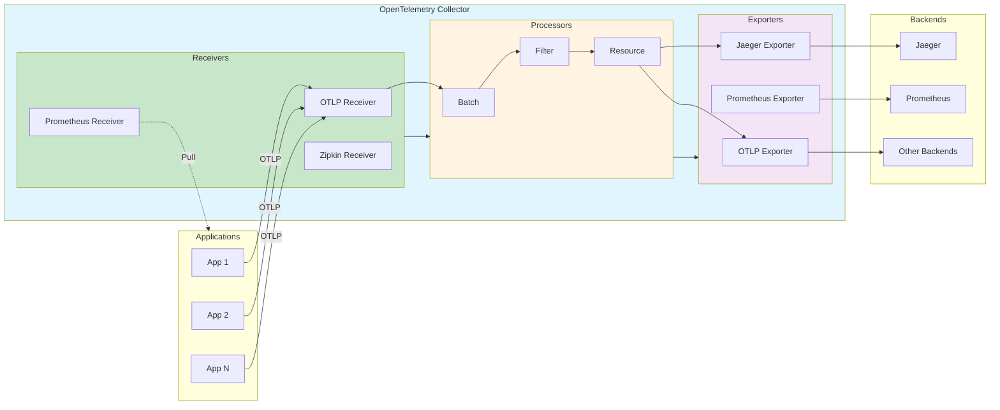
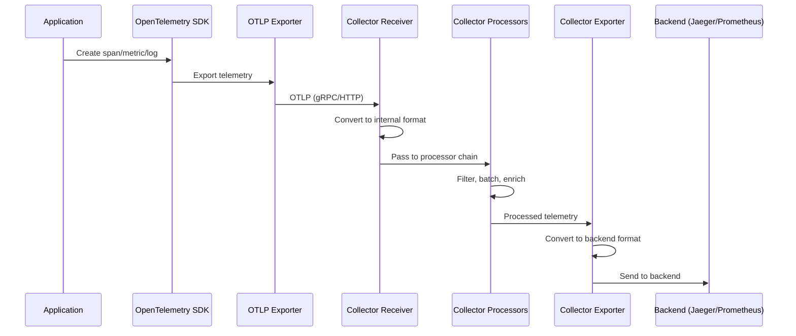

# OpenTelemetry Collector Architecture

> **Overview**: This document explains the architecture of the OpenTelemetry Collector, a standalone service that decouples telemetry generation from processing and exporting. It details how the Collector enables flexible, centralized telemetry management through receivers, processors, and exporters.

## Introduction

The OpenTelemetry Collector is a **standalone service** that acts as an intermediary between applications generating telemetry and observability backends. Unlike SDK-based telemetry pipelines, the Collector allows operators to configure telemetry processing, routing, and transformation **without altering application code**.

### Key Value Proposition

**Decoupling**: The Collector separates two concerns:
- **Application Developers**: Focus on instrumentation (using SDK)
- **Operators**: Configure processing, routing, and backends (via YAML)

This separation provides:
- **Flexibility**: Change backends without code changes
- **Scalability**: Scale collectors independently from applications
- **Operational Efficiency**: Centralized configuration and monitoring
- **Vendor-Agnostic Processing**: Process telemetry in a standardized way

### Simple Analogy: The Post Office

Think of the Collector like a post office:
- **Applications** = People sending letters (telemetry)
- **Receivers** = Mailboxes (collecting letters)
- **Processors** = Sorting machines (organizing, filtering, enriching)
- **Exporters** = Delivery trucks (sending to final destinations)
- **Backends** = Recipients (Jaeger, Prometheus, etc.)

Just like you don't need to know the final destination's address format when you drop a letter in a mailbox, applications don't need to know backend-specific formats—the Collector handles the conversion.

## Architecture Overview

The Collector architecture consists of three main components connected through pipelines:



## Core Components

### 1. Receivers: Data Ingestion

**Purpose**: How data gets from sources (applications) to the Collector.

**Characteristics**:
- Can be **push-based** (application sends data) or **pull-based** (collector fetches data)
- Accept telemetry in various protocols and formats
- Convert incoming data to Collector's internal representation
- Pass data to processor chains

**Built-in Receivers**:
- **OTLP Receiver**: Receives traces, metrics, and logs in OpenTelemetry's native format
  - Supports gRPC (port 4317) and HTTP (port 4318)
- **Prometheus Receiver**: Pulls metrics from Prometheus endpoints
- **Zipkin Receiver**: Receives traces in Zipkin format
- **StatsD Receiver**: Receives StatsD metrics

**Example Configuration**:
```yaml
receivers:
  otlp:
    protocols:
      grpc:
        endpoint: 0.0.0.0:4317
      http:
        endpoint: 0.0.0.0:4318
  prometheus:
    config:
      scrape_configs:
        - job_name: 'my-service'
          scrape_interval: 15s
```

**How It Works**:
1. Receiver listens on configured endpoint
2. Accepts telemetry data in source format
3. Converts to internal representation (normalized format)
4. Passes to processor chain

### 2. Processors: Data Transformation

**Purpose**: Pre-process telemetry before sending it to backends.

**Categories**:

#### A. Data Quality Improvement
- **Attributes Processor**: Add, delete, rename, transform attributes
- **Resource Processor**: Add resource-level attributes
- **Transform Processor**: Complex transformations

#### B. Governance & Compliance
- **Routing Processor**: Route data to specific backends based on attributes
- **Filter Processor**: Allow/deny lists for compliance

#### C. Cost Reduction
- **Filter Processor**: Drop unwanted telemetry
- **Tail Sampling Processor**: Sample traces based on outcomes (requires centralized view)

#### D. Security
- **Attributes Processor**: Scrub sensitive information
- **Filter Processor**: Remove PII before storage

#### E. Flow Control
- **Batch Processor**: Group telemetry for efficient transmission
- **Memory Limiter**: Prevent memory exhaustion
- **Retry Processor**: Handle transient failures

**Important**: Processors form a **sequential chain**—order matters!

**Example Configuration**:
```yaml
processors:
  batch:
    timeout: 10s
    send_batch_size: 1024
  attributes/example:
    actions:
      - key: example_field
        action: insert
        value: Hello from the OpenTelemetry Collector
  filter/noise:
    traces:
      span:
        - 'attributes["http.status_code"] != 404'
```

**Processor Order Example**:
```yaml
processors: [filter/noise, batch, attributes/example]
# Flow: Filter → Batch → Add Attributes → Export
```

### 3. Exporters: Data Forwarding

**Purpose**: Convert internal representation to protocol and forward to destinations.

**Characteristics**:
- Convert Collector's internal format to backend-specific format
- Can forward to one or more destinations
- Handle protocol conversion (OTLP → Jaeger format, etc.)

**Built-in Exporters**:
- **OTLP Exporter**: Sends data in OpenTelemetry Protocol format
- **Jaeger Exporter**: Exports traces to Jaeger
- **Prometheus Exporter**: Exports metrics to Prometheus
- **Debug Exporter**: Outputs telemetry to console/logs (for debugging)

**Example Configuration**:
```yaml
exporters:
  debug:
    verbosity: detailed
  otlp:
    endpoint: "jaeger:4317"
    tls:
      insecure: true
  otlphttp/prometheus:
    endpoint: "http://prometheus:9090/api/v1/otlp"
    tls:
      insecure: true
```

**Multiple Exporters**: When multiple exporters are specified, data is **copied** to all of them:
```yaml
exporters: [otlp, debug]  # Same data sent to both
```

## Pipeline Configuration

Pipelines connect receivers, processors, and exporters for specific telemetry types.

### Pipeline Structure

```yaml
service:
  pipelines:
    traces:                    # Pipeline ID: datatype
      receivers: [otlp]        # List of receiver IDs
      processors: [batch]      # List of processor IDs (order matters!)
      exporters: [debug]       # List of exporter IDs
    metrics:
      receivers: [otlp]
      processors: [batch]
      exporters: [otlphttp/prometheus]
    logs:
      receivers: [otlp]
      processors: [batch, attributes/example]
      exporters: [debug]
```

### Pipeline Behavior Rules

1. **Multiple Receivers**: Data streams **merge** before processors
   ```yaml
   traces:
     receivers: [otlp, otlp/2]  # Streams merge
   ```

2. **Multiple Processors**: Processors execute **sequentially**
   ```yaml
   traces:
     processors: [filter, batch, attributes]  # Order matters!
   ```

3. **Multiple Exporters**: Data stream is **copied** to all exporters
   ```yaml
   traces:
     exporters: [jaeger, debug]  # Same data sent to both
   ```

4. **Shared Components**: Components can be reused across pipelines
   - Same receiver in different pipelines: Each pipeline gets a **replica**
   - Same exporter from different pipelines: Streams **merge** into one

### Complete Configuration Example

```yaml
receivers:
  otlp:
    protocols:
      grpc:
        endpoint: 0.0.0.0:4317
      http:
        endpoint: 0.0.0.0:4318

processors:
  batch:
    timeout: 10s
    send_batch_size: 1024
  attributes/enrich:
    actions:
      - key: environment
        action: insert
        value: production

exporters:
  debug:
    verbosity: detailed
  otlp/jaeger:
    endpoint: "jaeger:4317"
  otlphttp/prometheus:
    endpoint: "http://prometheus:9090/api/v1/otlp"

service:
  pipelines:
    traces:
      receivers: [otlp]
      processors: [batch, attributes/enrich]
      exporters: [otlp/jaeger, debug]
    metrics:
      receivers: [otlp]
      processors: [batch, attributes/enrich]
      exporters: [otlphttp/prometheus, debug]
    logs:
      receivers: [otlp]
      processors: [batch, attributes/enrich]
      exporters: [debug]
```

## Component IDs and Configuration

### Component ID Structure

Each component has:
- **ID**: Unique identifier = `type` (and optionally `/name`)
- **Parameters**: Type-dependent configuration fields

**ID Format**:
```yaml
receivers:
  otlp:                    # ID: type = "otlp", no name
  otlp/secondary:         # ID: type = "otlp", name = "secondary"

processors:
  batch:                  # ID: type = "batch"
  attributes/example:     # ID: type = "attributes", name = "example"

exporters:
  debug:                 # ID: type = "debug"
  otlp/jaeger:           # ID: type = "otlp", name = "jaeger"
```

**Pipeline References**:
```yaml
service:
  pipelines:
    traces:
      receivers: [otlp, otlp/secondary]  # References receiver IDs
      processors: [batch, attributes/example]  # References processor IDs
      exporters: [debug, otlp/jaeger]  # References exporter IDs
```

## Deployment Topologies

The Collector supports three deployment topologies, each with unique benefits:

### 1. Sidecar Deployment

**Architecture**: Collector runs as a container next to the application in the same pod.

**Characteristics**:
- **Communication**: Application and collector share localhost
- **Latency**: Lowest (localhost communication)
- **Resource Usage**: Per-pod overhead
- **Scalability**: Scales with pods (automatic)

**Advantages**:
- Fast offload: localhost communication is fast and reliable
- Consistent destination: application always sends to `localhost:4317`
- Low latency: application not affected by network latency
- Resource isolation: collector doesn't compete with other applications

**Use Cases**:
- High isolation requirements
- Need for fast telemetry offloading
- Per-application filtering/enrichment

**Example (Kubernetes)**:
```yaml
apiVersion: v1
kind: Pod
spec:
  containers:
  - name: app
    image: myapp:latest
  - name: otel-collector
    image: otel/opentelemetry-collector-contrib:latest
```

### 2. Agent Deployment (Node Agent)

**Architecture**: One collector per node in the cluster (DaemonSet).

**Characteristics**:
- **Communication**: Applications send to node-local collector
- **Latency**: Low (node-local)
- **Resource Usage**: Per-node overhead
- **Scalability**: Scales with nodes

**Advantages**:
- Fast offload: applications can evacuate telemetry quickly
- Reduced connections: fewer collector instances than sidecars
- System-level telemetry: can collect host/node-level metrics
- Resource enrichment: can add node/host attributes

**Use Cases**:
- Balanced approach between isolation and resource usage
- Need for node-level telemetry
- Want to reduce collector instances

**Example (Kubernetes DaemonSet)**:
```yaml
apiVersion: apps/v1
kind: DaemonSet
metadata:
  name: otel-collector-agent
spec:
  template:
    spec:
      containers:
      - name: otel-collector
        image: otel/opentelemetry-collector-contrib:latest
        # Runs on every node
```

### 3. Standalone Service Deployment

**Architecture**: Dedicated service in the cluster, horizontally scalable.

**Characteristics**:
- **Communication**: Applications send over network
- **Latency**: Higher (network communication)
- **Resource Usage**: Dedicated resources
- **Scalability**: Cluster-level, independent scaling

**Advantages**:
- Resource isolation: dedicated machines, no competition with apps
- Horizontal scalability: scale based on demand
- Load distribution: load balancer prevents single collector overload
- Advanced processing: supports tail sampling, complex routing
- Handles high-volume scenarios: better buffering and processing capacity

**Considerations**:
- Network latency: applications send over network (vs localhost)
- More complex: requires load balancer and scaling configuration

**Use Cases**:
- Production environments with high telemetry volumes
- Need for advanced processing (tail sampling, complex routing)
- Dedicated resources available

**Example (Docker Compose)**:
```yaml
services:
  otelcol:
    image: otel/opentelemetry-collector-contrib:latest
    restart: unless-stopped
    command: ["--config=/etc/otel-collector-config.yml"]
    volumes:
      - ./otel-collector-config.yml:/etc/otel-collector-config.yml
    ports:
      - "4317:4317"   # OTLP gRPC receiver
      - "4318:4318"    # OTLP HTTP receiver
```

### Comparison Table

| Topology | Latency | Resource Usage | Scalability | Complexity | Best For |
|----------|---------|----------------|-------------|------------|----------|
| **Sidecar** | Lowest (localhost) | Per-pod overhead | Pod-level | Medium | High isolation needs |
| **Agent** | Low (node-local) | Per-node overhead | Node-level | Low-Medium | Balanced approach |
| **Standalone** | Higher (network) | Dedicated resources | Cluster-level | High | Production scale |

## Multi-Tier Production Architecture

Production deployments often combine multiple topologies:

### Architecture Pattern

```
Applications (Pods)
    │
    ▼ (localhost)
[Sidecar Collectors]  ← Fast offload, initial filtering
    │
    ▼ (OTLP over network)
[Node Agents]         ← Node-level enrichment (optional)
    │
    ▼ (OTLP over network)
[Standalone Service]  ← Advanced processing, routing
    │
    ▼
Backends (Jaeger, Prometheus, etc.)
```

### Why Multi-Tier?

**OTLP Enables Chaining**: Since OTLP normalizes data, collectors can forward to other collectors seamlessly.

**Different Processors Need Different Context**:
- **Local Processing** (Sidecar/Agent): Fast filtering, basic batching, resource enrichment
- **Centralized Processing** (Standalone): Tail sampling (requires complete traces), complex routing, cross-service correlation

### Example: Sidecar → Standalone

**Tier 1: Sidecar Collector**
```yaml
# Fast offload and initial filtering
receivers:
  otlp:
    protocols:
      grpc:
        endpoint: 0.0.0.0:4317

processors:
  filter/noise:
    traces:
      span:
        - 'attributes["http.status_code"] != 404'
  batch:
    timeout: 1s

exporters:
  otlp/central:
    endpoint: otel-collector-service:4317

service:
  pipelines:
    traces:
      receivers: [otlp]
      processors: [filter/noise, batch]
      exporters: [otlp/central]
```

**Tier 2: Standalone Collector**
```yaml
# Advanced processing requiring centralized view
receivers:
  otlp:
    protocols:
      grpc:
        endpoint: 0.0.0.0:4317

processors:
  tail_sampling:
    policies:
      - name: sample-errors
        type: status_code
        status_code:
          status_codes: [ERROR]
  batch:
    timeout: 5s

exporters:
  otlp/jaeger:
    endpoint: jaeger:4317

service:
  pipelines:
    traces:
      receivers: [otlp]
      processors: [tail_sampling, batch]
      exporters: [otlp/jaeger]
```

## Complete Data Flow

### End-to-End Flow



### Data Transformation Stages

1. **Application → SDK**: Raw operation → Structured span/metric/log object
2. **SDK → Exporter**: SDK object → OTLP protocol buffer format
3. **Exporter → Collector Receiver**: OTLP protobuf → Network transmission (gRPC/HTTP)
4. **Receiver → Internal Format**: Source format → Collector's internal representation
5. **Processors**: Transform, filter, enrich internal representation
6. **Exporter → Backend**: Internal format → Backend-specific format

## Key Benefits

### 1. Decoupling

**Without Collector**:
- Each application configures its own exporter
- Backend changes require code changes
- No centralized processing

**With Collector**:
- Applications just send OTLP
- Backend changes = config changes
- Centralized processing and routing

### 2. Vendor-Agnostic Processing

- Applications use standard OTLP
- Collector handles protocol conversion
- Easy to switch backends

### 3. Scalability

- Independent scaling of collectors
- Horizontal scaling with load balancer
- Resource isolation from applications

### 4. Operational Efficiency

- Centralized configuration
- Consistent processing across applications
- Reduced developer burden
- Single point for monitoring telemetry health

### 5. Flexibility

- Multiple receivers (various protocols)
- Multiple processors (transformations)
- Multiple exporters (multiple backends)
- Easy to add/remove components

## Real-World Example from Codebase

### Current Setup

The codebase demonstrates a **standalone service** deployment:

**Docker Compose Configuration**:
```yaml
otelcol:
  image: ${COLLECTOR_CONTRIB_IMAGE}
  restart: unless-stopped
  networks:
    - todonet
  command: ["--config=/etc/otel-collector-config.yml", ""]
  volumes:
    - ./collector/otel-collector-config.yml:/etc/otel-collector-config.yml
  ports:
    - "4317:4317"   # OTLP gRPC receiver
    - "4318:4318"   # OTLP HTTP receiver
```

**Collector Configuration**:
```yaml
receivers:
  otlp:
    protocols:
      grpc:
        endpoint: 0.0.0.0:4317

exporters:
  debug:
  otlp:
    endpoint: "jaeger:4317"
    tls:
      insecure: true
  otlphttp/prometheus:
    endpoint: "http://prometheus:9090/api/v1/otlp"
    tls:
      insecure: true

processors:
  batch:

service:
  pipelines:
    traces:
      receivers: [otlp]
      processors: [batch]
      exporters: [otlp, debug]
    metrics:
      receivers: [otlp]
      processors: [batch]
      exporters: [otlphttp/prometheus, debug]
```

**Application Configuration**:
```yaml
# Applications just point to collector
environment:
  - OTEL_EXPORTER_OTLP_ENDPOINT=http://otelcol:4317
  - OTEL_EXPORTER_OTLP_TRACES_PROTOCOL=grpc
  - OTEL_EXPORTER_OTLP_METRICS_PROTOCOL=grpc
```

**Benefits Demonstrated**:
- Multiple services (`todobackend-springboot`, `todoui-thymeleaf`, `todoui-flask`) send to same collector
- Consistent processing across all services
- Easy to change backends (just modify collector config)
- No application code changes needed

## Common Processor Use Cases

### 1. Batching
```yaml
processors:
  batch:
    timeout: 10s
    send_batch_size: 1024
```
**Purpose**: Group telemetry for efficient transmission

### 2. Filtering
```yaml
processors:
  filter/noise:
    traces:
      span:
        - 'attributes["http.status_code"] != 404'
        - 'name != "healthcheck"'
```
**Purpose**: Drop unwanted telemetry early

### 3. Resource Enrichment
```yaml
processors:
  resource/enrich:
    attributes:
      - key: environment
        action: insert
        value: production
      - key: cluster
        action: insert
        value: prod-cluster-1
```
**Purpose**: Add metadata to all telemetry

### 4. Tail Sampling
```yaml
processors:
  tail_sampling:
    policies:
      - name: sample-errors
        type: status_code
        status_code:
          status_codes: [ERROR]
      - name: sample-slow
        type: latency
        latency:
          threshold_ms: 1000
```
**Purpose**: Sample traces based on outcomes (requires centralized collector)

### 5. Routing
```yaml
processors:
  routing:
    from_attribute: environment
    default_exporters: [production_backend]
    table:
      - value: staging
        exporters: [staging_backend]
```
**Purpose**: Route telemetry to different backends based on attributes

## Best Practices

### 1. Processor Order Matters
```yaml
# Good: Filter before batching
processors: [filter/noise, batch]

# Less efficient: Batch before filtering
processors: [batch, filter/noise]
```

### 2. Use Memory Limiter
```yaml
processors:
  memory_limiter:
    limit_mib: 512
    spike_limit_mib: 128
```
**Purpose**: Prevent OOM errors

### 3. Batch for Efficiency
```yaml
processors:
  batch:
    timeout: 10s
    send_batch_size: 1024
```
**Purpose**: Reduce network overhead

### 4. Filter Early
```yaml
# Filter noise before expensive processing
processors: [filter/noise, batch, tail_sampling]
```

### 5. Use Debug Exporter for Development
```yaml
exporters:
  debug:
    verbosity: detailed

service:
  pipelines:
    traces:
      exporters: [debug]  # See telemetry in logs
```

## Troubleshooting

### Common Issues

1. **No telemetry reaching backends**
   - Check receiver endpoints
   - Verify pipeline configuration
   - Check exporter endpoints

2. **High memory usage**
   - Add memory_limiter processor
   - Reduce batch sizes
   - Add filtering to reduce volume

3. **Missing telemetry**
   - Check filter processors (may be too aggressive)
   - Verify sampling configuration
   - Check exporter configuration

### Debugging Tips

1. **Use Debug Exporter**:
   ```yaml
   exporters:
     debug:
       verbosity: detailed
   ```

2. **Check Collector Logs**:
   ```bash
   docker logs otelcol
   ```

3. **Verify Pipeline Configuration**:
   - Ensure receivers are listed in pipelines
   - Check processor order
   - Verify exporter endpoints

## Relationship to Other Documentation

- **`telemetryDataFlow.md`**: Shows how telemetry flows from applications to backends
- **`tracingArchitecture.md`**: Explains how applications generate telemetry
- **`openTelemetryArchitecture.md`**: Overview of OpenTelemetry architecture
- **`systemPatterns.md`**: Documents patterns used in the codebase

## Summary

The OpenTelemetry Collector provides:

1. **Decoupling**: Separates telemetry generation from processing
2. **Flexibility**: Vendor-agnostic processing via OTLP
3. **Scalability**: Independent scaling of collectors
4. **Operational Efficiency**: Centralized configuration
5. **Developer Experience**: No telemetry pipeline code in applications
6. **Consistency**: Same processing rules across all services

By using receivers, processors, and exporters, the Collector enables flexible, centralized telemetry management that scales from development to enterprise production deployments.

---

**Key Takeaway**: The Collector is a powerful tool that allows operators to manage observability data without requiring changes to application code, providing flexibility, scalability, and operational efficiency.

