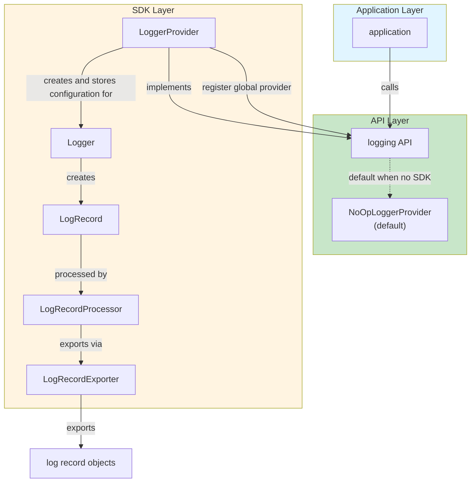
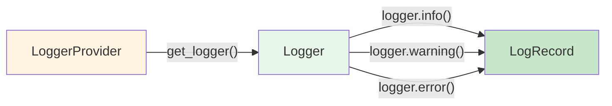
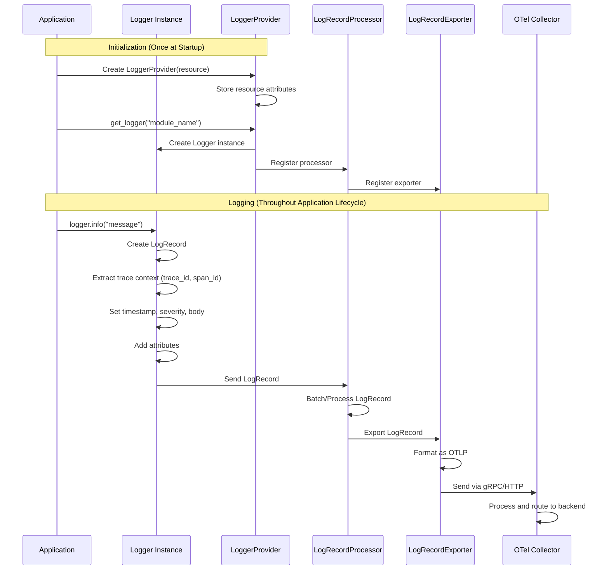
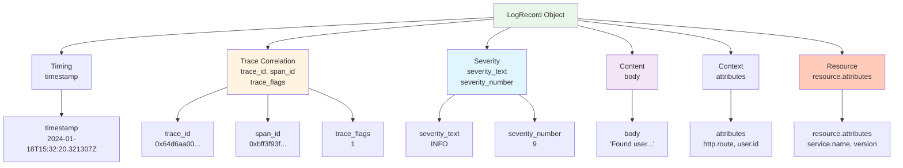
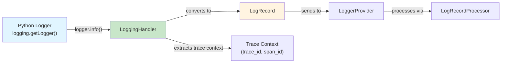
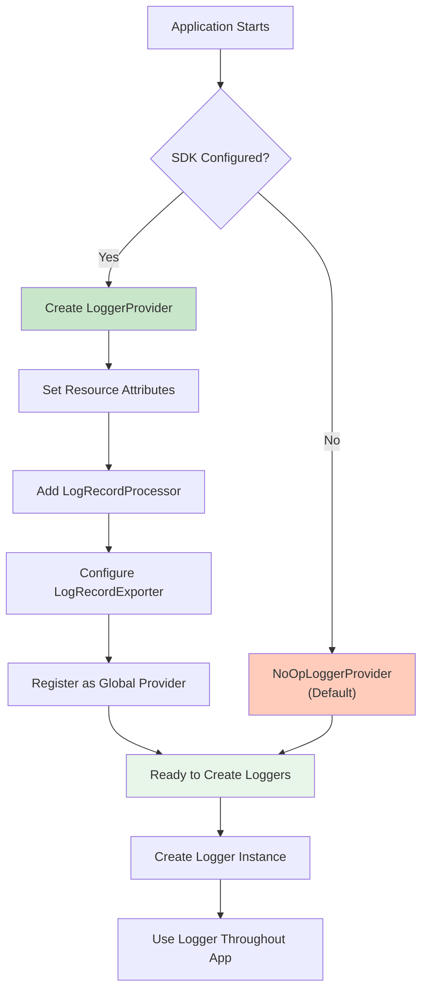
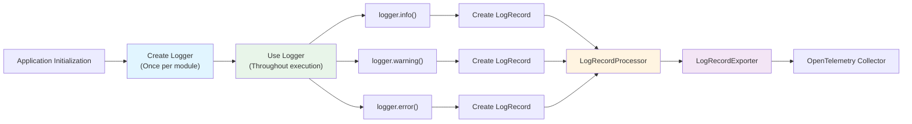

# Logging Architecture: Producing Telemetry

> **Overview**: This document explains the architecture for producing telemetry, specifically logging data, within an application using the OpenTelemetry SDK. It details how applications interact with the logging API and SDK to generate, process, and export log records with trace correlation.

## Introduction

The "producing telemetry" architecture demonstrates how an application generates logging data through a three-layer system: **Application Layer**, **API Layer**, and **SDK Layer**. This architecture ensures that log generation is decoupled from the application code, allowing for flexible instrumentation, trace correlation, and export strategies.

### Key Concepts

- **Application**: Your code that needs to be observed
- **Logging API**: The interface your application calls to create logs
- **SDK**: The implementation that actually generates and processes telemetry
- **LogRecord**: The fundamental unit of logging data, representing a single log entry
- **Trace Correlation**: Automatic linking of logs to traces via trace_id and span_id

## Three-Layer Architecture

The architecture consists of three distinct layers, each with specific responsibilities:



### Layer 1: Application Layer

**Purpose**: Your application code that needs observability.

**What it does**:
- Executes business logic
- Calls the logging API (typically via Python's standard `logging` module)
- Does not need to know about SDK implementation details

**Example**:
```python
import logging
from logging_utils import handler

# Configure logger
logger = logging.getLogger(__name__)
logger.addHandler(handler)

# Application code logs messages
@app.route("/users")
def get_user():
    logger.info("Fetching user 123")
    user = fetch_user(123)
    logger.info(f"Found user: {user.name}")
    return user
```

### Layer 2: API Layer

**Purpose**: Provides a stable interface for applications to create telemetry.

**Components**:

#### Logging API
- **What it is**: The interface that applications call (typically via Python's `logging` module)
- **Purpose**: Abstracts away SDK implementation details
- **Key Functions**:
  - `logging.getLogger()` - Get a logger instance
  - `logger.info()` - Create an INFO level log record
  - `logger.warning()` - Create a WARNING level log record
  - `logger.error()` - Create an ERROR level log record
  - `logger.debug()` - Create a DEBUG level log record

#### NoOpLoggerProvider (Default)
- **What it is**: A no-operation provider that does nothing
- **When it's used**: When no SDK is configured
- **Purpose**: Prevents errors when SDK is not initialized
- **Behavior**: All API calls succeed but produce no telemetry

**Why NoOpLoggerProvider exists**:
- Allows libraries to call logging API without checking if SDK is configured
- Prevents crashes when OpenTelemetry is not set up
- Enables gradual adoption of observability

```python
# Without SDK configured, NoOpLoggerProvider is used
import logging

logger = logging.getLogger(__name__)
# This works but produces no telemetry
logger.info("Message")  # No log records are actually created
```

### Layer 3: SDK Layer

**Purpose**: The actual implementation that generates, processes, and exports telemetry.

**Components**:

#### LoggerProvider
- **What it is**: The SDK component that implements the logging API
- **Responsibilities**:
  - Implements the logging API interface
  - Registers itself as the global provider
  - Creates and manages Logger instances
  - Stores configuration (resource attributes, processors, exporters)
  - Manages application lifecycle (initialized once at startup)

**How it works**:
```python
from opentelemetry.sdk._logs import LoggerProvider
from opentelemetry.sdk.resources import Resource

# Create provider (typically done once at startup)
logger_provider = LoggerProvider(
    resource=Resource.create({
        "service.name": "example-app",
        "service.version": "1.0.0",
        "deployment.environment": "production"
    })
)

# Register processors
logger_provider.add_log_record_processor(processor)
```

**Key Characteristics**:
- **Lifecycle**: Created once at application startup, destroyed at shutdown
- **Resource Management**: Attaches service metadata to all logs
- **Factory Pattern**: Creates Logger instances via `get_logger()`

#### Logger
- **What it is**: Created by LoggerProvider, creates log entries
- **Responsibilities**:
  - Creates LogRecord instances when logging methods are called
  - Extracts trace context (trace_id, span_id) from current span
  - Manages logger configuration (name, version)
  - Reused throughout application lifecycle

**Logger Creation Flow**:


**Example**:
```python
from opentelemetry.sdk._logs import LoggerProvider

# Logger is created once per module/service
logger = logger_provider.get_logger(
    name="my_module",
    version="1.0.0"
)

# Throughout application lifecycle, reuse the same logger
logger.info("Application started")  # Creates LogRecord
logger.warning("Low memory")  # Creates another LogRecord
logger.error("Database connection failed")  # Creates another LogRecord
```

**Lifecycle**:
- **Created**: Once at module/service initialization
- **Used**: Throughout application execution
- **Destroyed**: When application shuts down

#### LogRecordProcessor
- **What it is**: Processes log records before export
- **Responsibilities**:
  - Receives LogRecord instances from Logger
  - May batch log records for efficiency
  - May filter or transform log records
  - Passes log records to LogRecordExporter

**Types of LogRecordProcessors**:
- **BatchLogRecordProcessor**: Batches log records before export (recommended for production)
- **SimpleLogRecordProcessor**: Exports log records immediately (lower latency, blocks application)

**Example**:
```python
from opentelemetry.sdk._logs.export import BatchLogRecordProcessor, SimpleLogRecordProcessor

# Simple processor (synchronous, immediate export)
processor = SimpleLogRecordProcessor(exporter=exporter)

# Batch processor (asynchronous, batched export - recommended for production)
processor = BatchLogRecordProcessor(
    exporter=exporter,
    max_queue_size=2048,
    export_timeout_millis=30000,
    schedule_delay_millis=5000
)

# Add to provider
logger_provider.add_log_record_processor(processor)
```

**Processor Responsibilities**:
1. Receives LogRecord from Logger
2. Processes/batches records
3. Sends to LogRecordExporter
4. Handles errors and retries

#### LogRecordExporter
- **What it is**: Exports log records to external systems
- **Responsibilities**:
  - Receives log records from LogRecordProcessor
  - Formats log records according to protocol (OTLP)
  - Sends log records to backend (collector, logging backend, etc.)

**Types of LogRecordExporters**:
- **OTLPLogExporter**: Exports via OTLP protocol (to collector) - standard for production
- **ConsoleLogExporter**: Exports to console (for debugging)

**Example**:
```python
from opentelemetry.exporter.otlp.proto.grpc._log_exporter import OTLPLogExporter
from opentelemetry.sdk._logs.export import ConsoleLogExporter

# OTLP exporter (production)
exporter = OTLPLogExporter(
    endpoint="http://otelcol:4317",
    insecure=True  # Use TLS in production
)

# Console exporter (development)
exporter = ConsoleLogExporter()

# Use with processor
processor = SimpleLogRecordProcessor(exporter=exporter)
```

## Complete Data Flow

Here's how data flows through the entire system:



### Step-by-Step Flow

1. **Application calls logging API**: `logger.info("Fetching user")`
2. **Logger creates LogRecord**: Extracts trace context, sets timestamp, severity, body
3. **Logger sends to Processor**: Completed LogRecord is passed to LogRecordProcessor
4. **Processor batches**: LogRecords are batched for efficiency (if using BatchLogRecordProcessor)
5. **Processor sends to Exporter**: Batched LogRecords are sent to LogRecordExporter
6. **Exporter formats and sends**: LogRecords are formatted (OTLP) and sent to backend

## LogRecord Structure

A LogRecord is the fundamental unit of logging data. Here's the complete structure of a LogRecord:

### LogRecord JSON Structure

```json
{
  "timestamp": "2024-01-18T15:32:20.321307Z",
  "trace_id": "0x64d6aa00b229557023afb032160c9237",
  "span_id": "0xbff3f93fb12ff4ac",
  "trace_flags": 1,
  "severity_number": 9,
  "severity_text": "INFO",
  "body": "Found user User(id=123, name='John') with status 200",
  "attributes": {
    "http.route": "/users",
    "http.method": "GET",
    "http.status_code": 200,
    "user.id": 123,
    "log.source": "app.py"
  },
  "resource": {
    "service.name": "example-app",
    "service.version": "1.0.0",
    "telemetry.sdk.language": "python",
    "telemetry.sdk.name": "opentelemetry",
    "telemetry.sdk.version": "1.24.0",
    "deployment.environment": "production"
  }
}
```

### Field Explanations

#### Timing Fields

- **`timestamp`**: When the log entry was created
  - Format: ISO 8601 with nanoseconds precision
  - Example: `"2024-01-18T15:32:20.321307Z"`
  - Automatically set by SDK when log is created
  - Critical for time-series analysis and correlation

#### Trace Correlation Fields

- **`trace_id`**: Links log to a trace
  - Format: 32 hex digits (128 bits)
  - Example: `"0x64d6aa00b229557023afb032160c9237"`
  - Extracted from current trace context if available
  - Enables correlation: find all logs for a specific trace
  - **Key Benefit**: Links logs to distributed traces across services

- **`span_id`**: Links log to a specific span
  - Format: 16 hex digits (64 bits)
  - Example: `"0xbff3f93fb12ff4ac"`
  - Extracted from current span context
  - Enables correlation: find logs within a specific span
  - **Key Benefit**: Links logs to specific operations within a trace

- **`trace_flags`**: Trace flags (sampling decision, etc.)
  - Format: Integer (typically 0x01 for sampled)
  - Example: `1` (sampled)
  - Indicates whether trace was sampled
  - Used for trace correlation and sampling decisions

**Trace Correlation Example**:
```python
from opentelemetry import trace

tracer = trace.get_tracer(__name__)

@app.route("/users/<user_id>")
def get_user(user_id):
    # Start a span
    with tracer.start_as_current_span("get_user") as span:
        span.set_attribute("user.id", user_id)
        
        # Log within span context - automatically includes trace_id and span_id
        logger.info(f"Fetching user {user_id}")
        # LogRecord includes:
        # - trace_id: from current span
        # - span_id: from current span
        
        user = fetch_user(user_id)
        logger.info(f"Found user: {user.name}")
        # This LogRecord also includes same trace_id and span_id
        # Enables correlation: all logs for this request share trace_id
```

#### Severity Fields

- **`severity_text`**: Human-readable severity level
  - Values: `"TRACE"`, `"DEBUG"`, `"INFO"`, `"WARN"`, `"ERROR"`, `"FATAL"`
  - Mapped from Python logging levels:
    ```python
    logging.DEBUG    → "DEBUG"
    logging.INFO     → "INFO"
    logging.WARNING  → "WARN"
    logging.ERROR    → "ERROR"
    logging.CRITICAL → "FATAL"
    ```
  - Used for filtering and alerting

- **`severity_number`**: Numeric severity (0-24)
  - Standardized across languages
  - Mapping:
    ```
    TRACE  = 1-4
    DEBUG  = 5-8
    INFO   = 9-12
    WARN   = 13-16
    ERROR  = 17-20
    FATAL  = 21-24
    ```
  - Enables numeric filtering and comparison

#### Content Fields

- **`body`**: The actual log message content
  - Can be string or structured data
  - Example: `"Found user User(id=123, name='John') with status 200"`
  - Supports f-strings, format strings, or structured logging
  - Contains the human-readable message

#### Context Fields

- **`attributes`**: Key-value pairs providing additional context
  - Follow semantic conventions when possible
  - Examples:
    ```python
    {
        "http.route": "/users",
        "http.method": "GET",
        "http.status_code": 200,
        "user.id": 123,
        "db.query.duration_ms": 45
    }
    ```
  - Used for filtering, searching, and analysis
  - Can be added programmatically:
    ```python
    logger.info("User fetched", extra={
        "user.id": 123,
        "response_time_ms": 45
    })
    ```

#### Resource Fields

- **`resource.attributes`**: Service-level metadata (from LoggerProvider)
  - Applied to all logs from this service
  - Examples:
    ```python
    {
        "service.name": "example-app",
        "service.version": "1.0.0",
        "deployment.environment": "production",
        "telemetry.sdk.language": "python",
        "telemetry.sdk.name": "opentelemetry",
        "telemetry.sdk.version": "1.24.0"
    }
    ```
  - Used for service identification and filtering
  - Set once at LoggerProvider creation

### Visual LogRecord Structure



## Integration with Python Logging

OpenTelemetry logging integrates seamlessly with Python's standard `logging` module via `LoggingHandler`:

### LoggingHandler Bridge

The `LoggingHandler` bridges Python's standard logging to OpenTelemetry:

```python
from opentelemetry.sdk._logs import LoggerProvider, LoggingHandler
from opentelemetry.sdk._logs.export import SimpleLogRecordProcessor
from opentelemetry.exporter.otlp.proto.grpc._log_exporter import OTLPLogExporter
import logging

# Step 1: Create LoggerProvider
logger_provider = LoggerProvider(
    resource=Resource.create({"service.name": "example-app"})
)

# Step 2: Create exporter and processor
exporter = OTLPLogExporter(endpoint="http://otelcol:4317", insecure=True)
processor = SimpleLogRecordProcessor(exporter=exporter)
logger_provider.add_log_record_processor(processor)

# Step 3: Create LoggingHandler (bridge)
handler = LoggingHandler(logger_provider=logger_provider)

# Step 4: Configure Python logger
logger = logging.getLogger(__name__)
logger.addHandler(handler)
logger.setLevel(logging.INFO)

# Step 5: Use standard Python logging
logger.info("Application started")  # Creates LogRecord with trace correlation
```

### How LoggingHandler Works



**Key Benefits**:
- No code changes needed - use standard Python logging
- Automatic trace context extraction
- Seamless integration with existing logging code
- Works with all Python logging features (formatters, filters, etc.)

## Complete Implementation Example

Here's a complete example showing all components working together:

```python
from opentelemetry.exporter.otlp.proto.grpc._log_exporter import OTLPLogExporter
from opentelemetry.sdk._logs import LoggerProvider, LoggingHandler
from opentelemetry.sdk._logs.export import SimpleLogRecordProcessor
from opentelemetry.sdk.resources import Resource
from opentelemetry import trace
import logging

# Step 1: Create LoggerProvider (once at startup)
logger_provider = LoggerProvider(
    resource=Resource.create({
        "service.name": "example-app",
        "service.version": "1.0.0",
        "deployment.environment": "production"
    })
)

# Step 2: Create LogRecordExporter
exporter = OTLPLogExporter(
    endpoint="http://otelcol:4317",
    insecure=True
)

# Step 3: Create LogRecordProcessor
processor = SimpleLogRecordProcessor(exporter=exporter)

# Step 4: Register processor with provider
logger_provider.add_log_record_processor(processor)

# Step 5: Create LoggingHandler (bridge to Python logging)
handler = LoggingHandler(logger_provider=logger_provider)

# Step 6: Configure Python logger
logger = logging.getLogger(__name__)
logger.addHandler(handler)
logger.setLevel(logging.INFO)

# Step 7: Use logger (creates LogRecords)
@app.route("/users/<user_id>")
def get_user(user_id):
    # Get tracer for trace correlation
    tracer = trace.get_tracer(__name__)
    
    # Start span
    with tracer.start_as_current_span("get_user") as span:
        span.set_attribute("user.id", user_id)
        
        # Log within span context
        # LogRecord automatically includes trace_id and span_id
        logger.info(f"Fetching user {user_id}")
        
        user = fetch_user(user_id)
        
        if user:
            logger.info(f"Found user: {user.name}")
            # Both log records share same trace_id and span_id
        else:
            logger.warning(f"User {user_id} not found")
            
    return user
```

## Trace Correlation in Action

When logging within a trace context, LogRecords automatically include trace correlation:

```python
from opentelemetry import trace

tracer = trace.get_tracer(__name__)

@app.route("/users/<user_id>")
def get_user(user_id):
    # Start a span
    with tracer.start_as_current_span("get_user") as span:
        span.set_attribute("user.id", user_id)
        
        # All logs within this span context share trace_id and span_id
        logger.info(f"Fetching user {user_id}")
        # LogRecord: {
        #   "trace_id": "0x64d6aa00...",
        #   "span_id": "0xbff3f93f...",
        #   "body": "Fetching user 123"
        # }
        
        user = fetch_user(user_id)
        
        logger.info(f"Found user: {user.name}")
        # LogRecord: {
        #   "trace_id": "0x64d6aa00...",  # Same trace_id
        #   "span_id": "0xbff3f93f...",   # Same span_id
        #   "body": "Found user: John"
        # }
        
    return user
```

**Correlation Benefits**:
- **Find all logs for a trace**: Query logs by trace_id to see all log entries for a request
- **Find logs for a span**: Query logs by span_id to see logs for a specific operation
- **Debug distributed systems**: Trace a request across services using trace_id
- **Context-aware debugging**: See logs in context of the trace they belong to

## Component Relationships

### Provider Registration Flow



### Logger Lifecycle



## Key Takeaways

1. **LoggerProvider**: Factory created once at startup, manages resource attributes and processors
2. **Logger**: Created once per module/service, reused throughout application lifecycle
3. **LogRecord**: Structured log entry with timestamp, trace correlation, severity, body, and attributes
4. **LogRecordProcessor**: Processes logs (batching, filtering) before export
5. **LogRecordExporter**: Formats and sends logs to Collector via OTLP
6. **Trace Correlation**: Automatic via `trace_id` and `span_id` when logging within trace context
7. **Lifecycle**: Provider initialized once, Logger created once per module, LogRecords created on each log call
8. **Python Integration**: Seamless integration via `LoggingHandler` with standard Python logging

## Related Documentation

- `architecture/tracingArchitecture.md` - Understanding trace correlation
- `architecture/metricsArchitecture.md` - Metrics architecture for comparison
- `architecture/telemetryDataFlow.md` - How telemetry flows to backends
- `architecture/openTelemetryArchitecture.md` - Overall OpenTelemetry architecture

---

**Remember**: The logging architecture provides structured, correlated logging that integrates seamlessly with traces and metrics in OpenTelemetry. LogRecords automatically include trace context when logging within a span, enabling powerful correlation and debugging capabilities across distributed systems.

