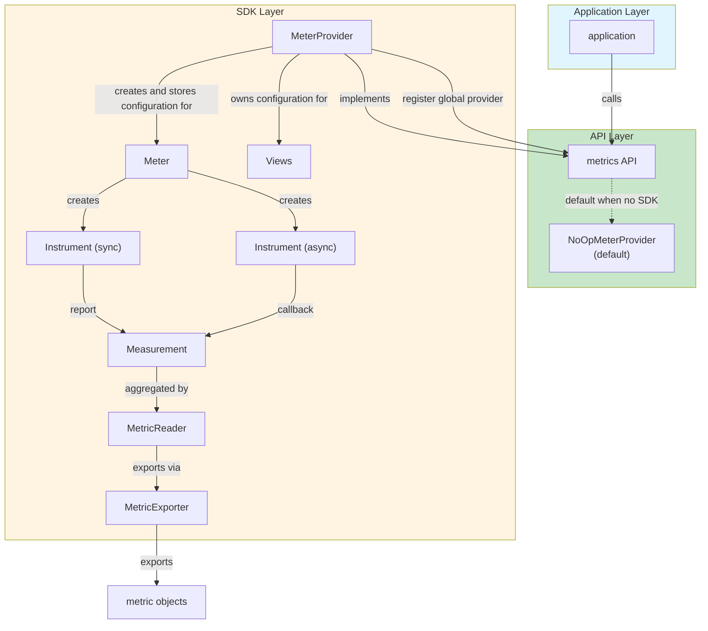
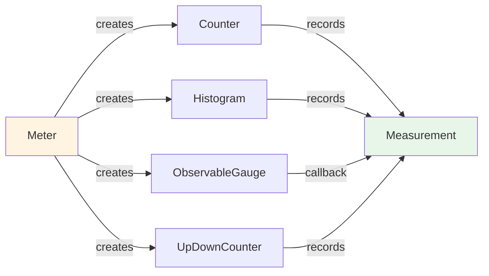
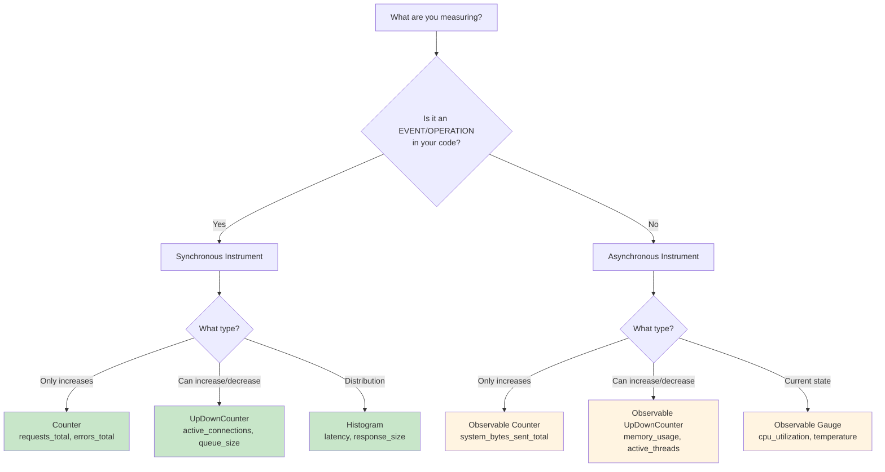
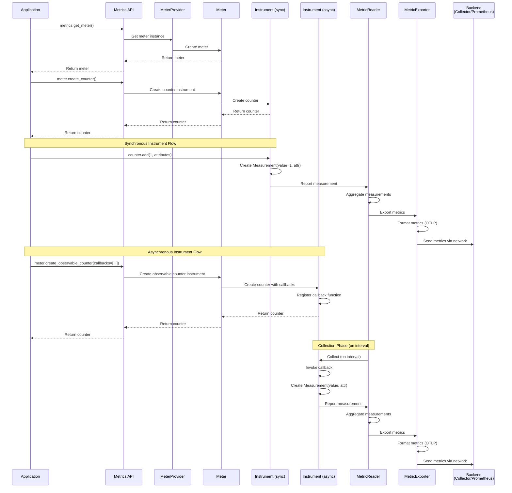
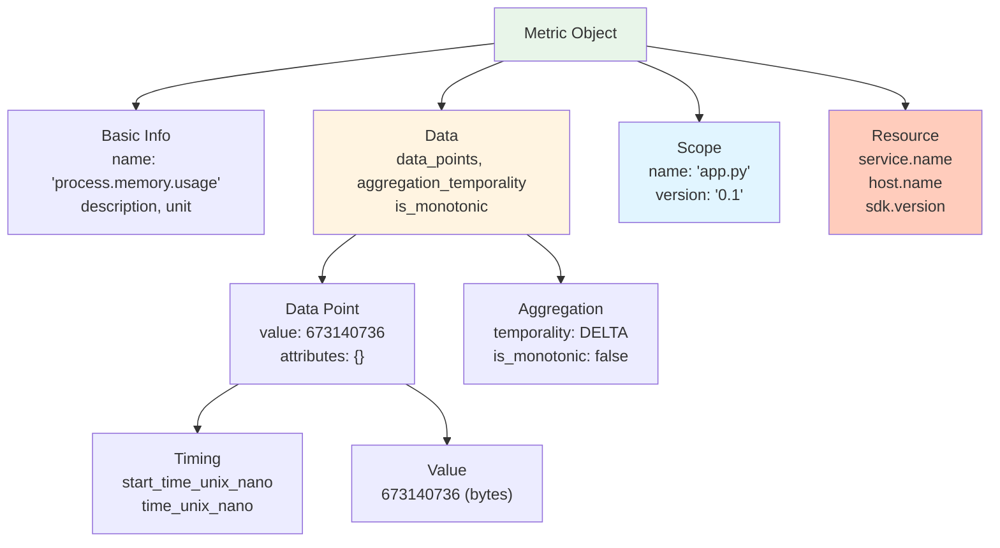
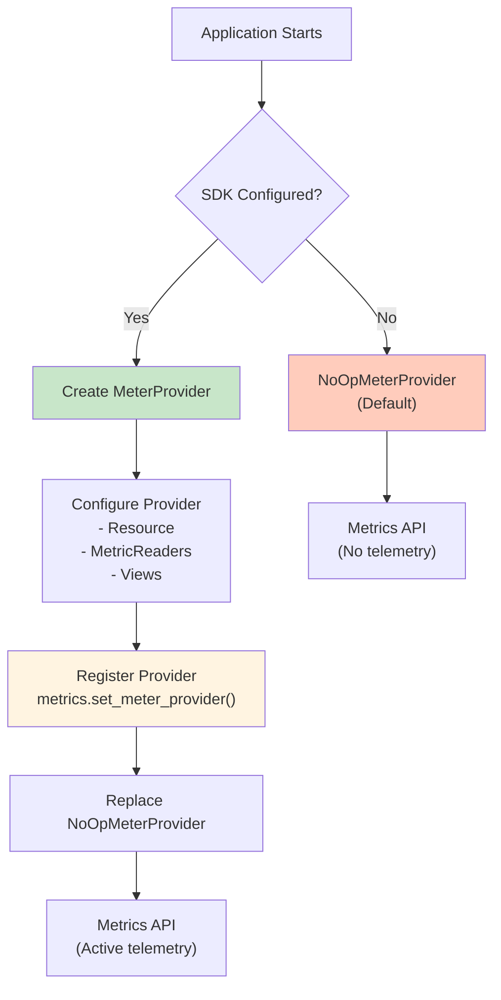
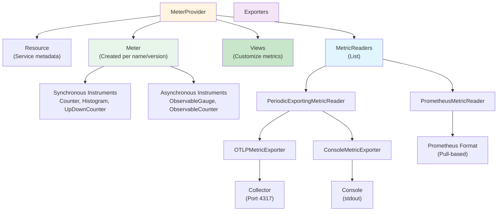
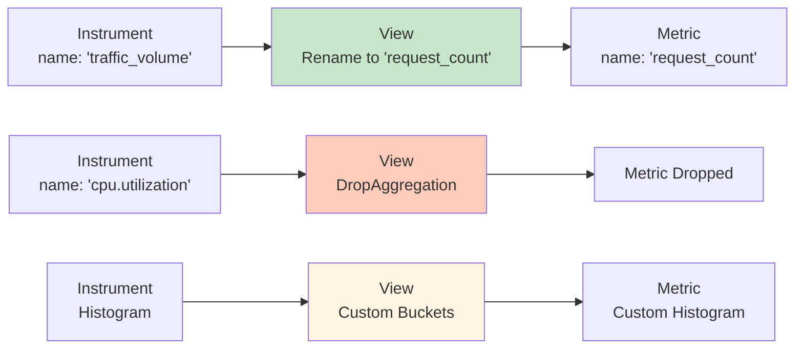

# Metrics Architecture: Producing Telemetry

> **Overview**: This document explains the architecture for producing telemetry, specifically metrics data, within an application using the OpenTelemetry SDK. It details how applications interact with the metrics API and SDK to generate, process, and export metrics.

## Introduction

The "producing telemetry" architecture demonstrates how an application generates metrics data through a three-layer system: **Application Layer**, **API Layer**, and **SDK Layer**. This architecture ensures that telemetry generation is decoupled from the application code, allowing for flexible instrumentation and export strategies.

### Key Concepts

- **Application**: Your code that needs to be observed
- **Metrics API**: The interface your application calls to record metrics
- **SDK**: The implementation that actually generates and processes telemetry
- **Instruments**: Reusable objects that record measurements (Counter, Histogram, Gauge, etc.)
- **Measurements**: Individual data points recorded by instruments (value + attributes)
- **Metrics**: Aggregated measurements exported to backends

## Three-Layer Architecture

The architecture consists of three distinct layers, each with specific responsibilities:



### Layer 1: Application Layer

**Purpose**: Your application code that needs observability.

**What it does**:
- Executes business logic
- Calls the metrics API to record measurements
- Does not need to know about SDK implementation details

**Example**:
```python
from opentelemetry import metrics

# Application code calls the API
meter = metrics.get_meter("my-service")
counter = meter.create_counter("requests_total")
counter.add(1, attributes={"http.method": "GET", "status": "200"})
```

### Layer 2: API Layer

**Purpose**: Provides a stable interface for applications to create telemetry.

**Components**:

#### Metrics API
- **What it is**: The interface that applications call
- **Purpose**: Abstracts away SDK implementation details
- **Key Functions**:
  - `metrics.get_meter()` - Get a meter instance
  - `meter.create_counter()` - Create a counter instrument
  - `meter.create_histogram()` - Create a histogram instrument
  - `meter.create_observable_gauge()` - Create an observable gauge instrument
  - `counter.add()` - Record a measurement (synchronous)
  - `histogram.record()` - Record a measurement (synchronous)

#### NoOpMeterProvider (Default)
- **What it is**: A no-operation provider that does nothing
- **When it's used**: When no SDK is configured
- **Purpose**: Prevents errors when SDK is not initialized
- **Behavior**: All API calls succeed but produce no telemetry

**Why NoOpMeterProvider exists**:
- Allows libraries to call metrics API without checking if SDK is configured
- Prevents crashes when OpenTelemetry is not set up
- Enables gradual adoption of observability

```python
# Without SDK configured, NoOpMeterProvider is used
from opentelemetry import metrics

meter = metrics.get_meter("my-service")
counter = meter.create_counter("requests_total")
# This works but produces no telemetry
counter.add(1)  # No measurements are actually recorded
```

### Layer 3: SDK Layer

**Purpose**: The actual implementation that generates, processes, and exports telemetry.

**Components**:

#### MeterProvider
- **What it is**: The SDK component that implements the metrics API
- **Responsibilities**:
  - Implements the metrics API interface
  - Registers itself as the global provider
  - Creates and manages Meter instances
  - Stores configuration (resource attributes, readers, exporters, views)

**How it works**:
```python
from opentelemetry.sdk.metrics import MeterProvider
from opentelemetry import metrics

# Create provider
provider = MeterProvider(resource=resource, metric_readers=[reader], views=views)

# Register as global provider (replaces NoOpMeterProvider)
metrics.set_meter_provider(provider)

# Now API calls use this provider
meter = metrics.get_meter("my-service")  # Gets meter from provider
```

#### Meter
- **What it is**: Created by MeterProvider, creates instruments
- **Responsibilities**:
  - Creates instruments (Counter, Histogram, Gauge, etc.)
  - Stores configuration from MeterProvider
  - Manages instrument lifecycle

**Instrument Creation Flow**:


#### Instruments

Instruments are reusable objects that record measurements. There are two categories: **synchronous** and **asynchronous**.

**Synchronous Instruments**:
- Invoked inline with application logic
- Can be associated with the current context (trace context)
- Record measurements immediately when called

**Asynchronous Instruments**:
- Register callback functions
- Callbacks are invoked only on demand (when MetricReader collects)
- Cannot access current context directly
- Useful for system metrics that don't correspond to specific operations

#### MetricReader
- **What it is**: Collects measurements and triggers export
- **Responsibilities**:
  - Periodically collects measurements from instruments
  - Aggregates measurements into metrics
  - Triggers export via MetricExporter
  - Manages collection intervals

**Types of MetricReaders**:
- **PeriodicExportingMetricReader**: Collects periodically and exports via exporter
- **PrometheusMetricReader**: Exports in Prometheus format (pull-based)

**Example**:
```python
from opentelemetry.sdk.metrics.export import PeriodicExportingMetricReader

# Create reader with exporter
reader = PeriodicExportingMetricReader(
    exporter=exporter,
    export_interval_millis=5000  # Collect every 5 seconds
)

# Add to provider
provider = MeterProvider(metric_readers=[reader])
```

#### MetricExporter
- **What it is**: Exports metrics to external systems
- **Responsibilities**:
  - Receives metrics from MetricReader
  - Formats metrics according to protocol
  - Sends metrics to backend (collector, Prometheus, etc.)

**Types of MetricExporters**:
- **OTLPMetricExporter**: Exports via OTLP protocol (to collector)
- **ConsoleMetricExporter**: Exports to console (for debugging)
- **PrometheusMetricExporter**: Exports in Prometheus format

**Example**:
```python
from opentelemetry.exporter.otlp.proto.grpc.metric_exporter import OTLPMetricExporter

# Create exporter
exporter = OTLPMetricExporter(
    endpoint="http://otelcol:4317",
    insecure=True
)

# Use with reader
reader = PeriodicExportingMetricReader(exporter=exporter)
```

#### Views
- **What it is**: Customize metrics generated by SDK
- **Responsibilities**:
  - Rename metrics
  - Drop metrics
  - Change aggregation (e.g., histogram buckets)
  - Filter attributes

**Example**:
```python
from opentelemetry.sdk.metrics.view import View, DropAggregation

# Drop a specific instrument
drop_view = View(
    instrument_type=ObservableGauge,
    instrument_name="process.cpu.utilization",
    aggregation=DropAggregation()
)

# Rename a metric
rename_view = View(
    instrument_type=Counter,
    instrument_name="traffic_volume",
    name="request_count"
)

provider = MeterProvider(views=[drop_view, rename_view])
```

## Instrument Types

OpenTelemetry provides several types of instruments, each designed for specific use cases:

### Synchronous Instruments

**Counter**:
- **Purpose**: Monotonically increasing value(s)
- **Use case**: Count events (requests, errors, items processed)
- **Example**: Request count, error count
- **Operations**: `add(value, attributes)`

**UpDownCounter**:
- **Purpose**: Supports increments and decrements
- **Use case**: Count items that can go up or down (active connections, queue size)
- **Example**: Active connections, cache size
- **Operations**: `add(value, attributes)` (can be negative)

**Histogram**:
- **Purpose**: Frequency distribution of values
- **Use case**: Measure distributions (latency, size, duration)
- **Example**: Request latency, response size
- **Operations**: `record(value, attributes)`

### Asynchronous Instruments

**Observable Counter**:
- **Purpose**: Monotonically increasing value(s) via callback
- **Use case**: System metrics that increase over time
- **Example**: Total bytes sent, total operations completed
- **Operations**: Callback function returns `Observation(value, attributes)`

**Observable UpDownCounter**:
- **Purpose**: Supports increments and decrements via callback
- **Use case**: System metrics that can increase or decrease
- **Example**: Memory usage, active threads
- **Operations**: Callback function returns `Observation(value, attributes)`

**Observable Gauge**:
- **Purpose**: Non-additive value(s) via callback
- **Use case**: Current state measurements (CPU usage, temperature)
- **Example**: CPU utilization, current temperature
- **Operations**: Callback function returns `Observation(value, attributes)`

### Instrument Type Comparison

| Type | Sync/Async | Monotonic | Additive | Use Case |
|------|------------|-----------|----------|----------|
| Counter | Sync | Yes | Yes | Event counting |
| UpDownCounter | Sync | No | Yes | Counts that can decrease |
| Histogram | Sync | No | No | Value distributions |
| Observable Counter | Async | Yes | Yes | System counters |
| Observable UpDownCounter | Async | No | Yes | System counts |
| Observable Gauge | Async | No | No | Current state |

### Choosing the Right Instrument

Selecting the right instrument type is crucial for accurate metrics collection. Follow this two-step decision process:

#### Step 1: Synchronous vs Asynchronous?

**Use Synchronous Instruments when:**
- You're measuring something that happens **in your code** (events, operations)
- You want to record metrics at **specific points** in your application flow
- You need to attach attributes from the **current context** (trace context, request attributes)
- **Examples**: HTTP request count, request latency, database query count, error count

**Use Asynchronous Instruments when:**
- You're measuring **system state** that exists independently of your code
- The value is **always available** (you just need to read it)
- You don't need to record it at a specific point in your code flow
- **Examples**: CPU usage, memory usage, disk space, active connections

**Quick Test:**
- Can you call `add()` or `record()` at the exact moment something happens? → Use **Synchronous**
- Do you need to "read" a current value that exists independently? → Use **Asynchronous**

#### Step 2: Which Instrument Type?

**Synchronous Instruments:**

- **Counter** → Counting events that only increase
  - Examples: `http_requests_total`, `errors_total`, `items_processed_total`
  
- **UpDownCounter** → Counting things that can increase or decrease
  - Examples: `active_connections`, `queue_size`, `cache_items`
  
- **Histogram** → Measuring distributions of values
  - Examples: `http_request_duration`, `response_size_bytes`, `processing_time`

**Asynchronous Instruments:**

- **Observable Counter** → System-level counter that only increases
  - Examples: `system_bytes_sent_total`, `system_operations_total`
  
- **Observable UpDownCounter** → System-level count that can increase or decrease
  - Examples: `process_memory_usage`, `active_threads`
  
- **Observable Gauge** → Current state/snapshot value (not additive)
  - Examples: `cpu_utilization`, `temperature`, `disk_usage_percent`

#### Decision Tree



#### Quick Reference Table

| What You're Measuring | Instrument Type | Sync/Async | Example |
|----------------------|----------------|------------|---------|
| HTTP requests | Counter | Sync | `http_requests_total` |
| Request latency | Histogram | Sync | `http_request_duration` |
| Active connections | UpDownCounter | Sync | `active_connections` |
| Errors | Counter | Sync | `errors_total` |
| CPU usage | Observable Gauge | Async | `process.cpu.utilization` |
| Memory usage | Observable UpDownCounter | Async | `process.memory.usage` |
| Disk usage | Observable Gauge | Async | `disk.usage.percent` |
| Queue size | UpDownCounter | Sync | `queue_size` |
| Response size | Histogram | Sync | `http_response_size_bytes` |

<div style="background-color: #e3f2fd; border-left: 4px solid #2196f3; padding: 12px 16px; margin: 16px 0; border-radius: 4px;">

**💡 Rule of Thumb:**
- **Your code does something** → Synchronous
- **System has a value** → Asynchronous

</div>

#### Real-World Examples

**Synchronous (operation-based):**
```python
# Record when request arrives
traffic_volume = meter.create_counter("traffic_volume")
traffic_volume.add(1, attributes={"http.route": request.path})

# Record when request completes with latency
request_latency = meter.create_histogram("http.server.request.duration", unit="s")
request_latency.record(duration, attributes={"method": "GET"})
```

**Asynchronous (system state):**
```python
# Read CPU whenever SDK collects (every 5 seconds)
cpu_gauge = meter.create_observable_gauge(
    name="process.cpu.utilization",
    callbacks=[lambda x: [metrics.Observation(psutil.cpu_percent() / 100)]]
)

# Read memory whenever SDK collects
memory_gauge = meter.create_observable_up_down_counter(
    name="process.memory.usage",
    callbacks=[lambda x: [metrics.Observation(psutil.virtual_memory().used)]]
)
```

### Code Examples

**Synchronous Counter**:
```python
from opentelemetry import metrics

meter = metrics.get_meter("my-service")
request_counter = meter.create_counter(
    name="http_requests_total",
    unit="request",
    description="Total number of HTTP requests"
)

# Record a measurement
request_counter.add(1, attributes={"method": "GET", "status": "200"})
```

**Synchronous Histogram**:
```python
latency_histogram = meter.create_histogram(
    name="http_request_duration",
    unit="s",
    description="HTTP request latency"
)

# Record a measurement
latency_histogram.record(0.125, attributes={"method": "GET", "route": "/users"})
```

**Asynchronous Observable Gauge**:
```python
import psutil

cpu_gauge = meter.create_observable_gauge(
    name="process.cpu.utilization",
    callbacks=[
        lambda x: [metrics.Observation(psutil.cpu_percent(interval=1) / 100)]
    ],
    unit="1",
    description="CPU utilization"
)
```

## Complete Data Flow

Here's how data flows through the entire system:



### Step-by-Step Flow

#### Synchronous Instrument Flow

1. **Application calls API**: `counter.add(1, attributes={"method": "GET"})`
2. **Instrument creates Measurement**: `Measurement(value=1, attributes={"method": "GET"})`
3. **Measurement reported**: Sent to MetricReader immediately
4. **Reader aggregates**: Measurements aggregated into metrics over collection period
5. **Reader triggers export**: On collection interval, sends to MetricExporter
6. **Exporter formats**: Converts metrics to OTLP format
7. **Exporter sends**: Metrics sent to backend via network

#### Asynchronous Instrument Flow

1. **Callback registered**: Application creates async instrument with callback(s) via `meter.create_observable_counter(callbacks=[...])`
2. **Reader collects**: MetricReader invokes collection (on interval)
3. **Callback invoked**: Registered callback function is called
4. **Callback returns Observations**: `[Observation(value, attributes), ...]`
5. **Measurements created**: Observations converted to Measurements
6. **Measurements reported**: Sent to MetricReader
7. **Reader aggregates**: Measurements aggregated into metrics
8. **Reader triggers export**: Sends to MetricExporter
9. **Exporter formats and sends**: Metrics formatted and sent to backend

## Metric Structure

A metric is the fundamental unit of metrics data. Here's the structure of a metric as shown in the architecture diagram:

### Metric JSON Structure

```json
{
  "resource_metrics": [
    {
      "scope_metrics": [
        {
          "scope": {
            "name": "app.py",
            "version": "0.1",
            "schema_url": ""
          },
          "metrics": [
            {
              "name": "process.memory.usage",
              "description": "total amount of memory used",
              "unit": "By",
              "data": {
                "data_points": [
                  {
                    "attributes": {},
                    "start_time_unix_nano": 1713351214657218000,
                    "time_unix_nano": 1713351214657419300,
                    "value": 673140736
                  }
                ],
                "aggregation_temporality": 2,
                "is_monotonic": false
              }
            }
          ]
        }
      ],
      "resource": {
        "attributes": {
          "telemetry.sdk.language": "python",
          "host.name": "ebdcf73e98c0",
          "service.name": "app.py",
          "service.version": "0.1"
        }
      }
    }
  ]
}
```

### Field Explanations

#### Top-Level Structure

- **`resource_metrics`**: Array of resource metrics, each containing metrics from a single resource
  - Typically one entry per service/application instance
  - Groups metrics by resource attributes

#### Scope Metrics

- **`scope_metrics`**: Array of scope metrics, each containing metrics from a single instrumentation scope
  - Groups metrics by instrumentation library (meter name/version)
  - Example: All metrics from "app.py" version "0.1"

- **`scope.name`**: Name of the instrumentation scope (meter name)
  - Example: `"app.py"` - identifies which part of the application created the metric

- **`scope.version`**: Version of the instrumentation scope
  - Example: `"0.1"` - version of the instrumentation library

- **`scope.schema_url`**: URL to schema definition (usually empty)
  - Used for semantic conventions documentation

#### Metric Object

- **`name`**: The name of the metric
  - Should follow semantic conventions (e.g., `process.memory.usage`, `http.server.request.duration`)
  - Example: `"process.memory.usage"` for memory usage metric

- **`description`**: Human-readable description of what the metric measures
  - Example: `"total amount of memory used"`

- **`unit`**: Unit of measurement
  - Follows [UCUM (Unified Code for Units of Measure)](https://ucum.org/) standard
  - Examples: `"By"` (bytes), `"s"` (seconds), `"1"` (dimensionless), `"request"`

- **`data`**: The actual metric data
  - Contains data points and aggregation information
  - Structure varies by metric type (gauge, sum, histogram)

#### Data Points

- **`data_points`**: Array of individual data points
  - Each data point represents an aggregated measurement over a time period
  - Contains value, attributes, and timing information

- **`attributes`**: Key-value pairs describing the data point
  - Used to differentiate multiple time series
  - Example: `{"http.method": "GET", "http.status_code": "200"}`
  - Empty `{}` means no attributes (single time series)

- **`start_time_unix_nano`**: Start of the aggregation period
  - Format: Unix timestamp in nanoseconds
  - Example: `1713351214657218000` (nanoseconds since epoch)

- **`time_unix_nano`**: End of the aggregation period (collection time)
  - Format: Unix timestamp in nanoseconds
  - Example: `1713351214657419300`
  - Duration = time_unix_nano - start_time_unix_nano

- **`value`**: The metric value
  - Type depends on metric type (number for gauge/sum, array for histogram)
  - Example: `673140736` (bytes of memory used)

#### Aggregation Information

- **`aggregation_temporality`**: How measurements are aggregated over time
  - `1` = CUMULATIVE: Sum of all measurements since start
  - `2` = DELTA: Sum of measurements since last collection
  - Example: `2` (DELTA) - only includes measurements since last export

- **`is_monotonic`**: Whether the metric only increases
  - `true` for counters (monotonically increasing)
  - `false` for gauges, histograms, up-down counters
  - Example: `false` - memory usage can go up or down

#### Resource Attributes

- **`resource.attributes`**: Metadata about the service/environment
  - Applied to all metrics from this service
  - Includes SDK information and service identification
  - Examples:
    - `"telemetry.sdk.language": "python"` - Programming language
    - `"host.name": "ebdcf73e98c0"` - Host identifier
    - `"service.name": "app.py"` - Service name
    - `"service.version": "0.1"` - Service version

### Visual Metric Structure



## Component Relationships

### Provider Registration Flow



### Configuration Flow



### Views Flow

Views customize how instruments are transformed into metrics:



## Practical Examples

### Example 1: Basic Setup (Console Exporter)

This example shows how the architecture is used in practice:

```python
from opentelemetry import metrics
from opentelemetry.sdk.metrics import MeterProvider
from opentelemetry.sdk.metrics.export import (
    ConsoleMetricExporter,
    PeriodicExportingMetricReader,
)
from opentelemetry.sdk.resources import Resource

# Step 1: Create resource (metadata about service)
resource = Resource.create({
    "service.name": "my-service",
    "service.version": "1.0.0"
})

# Step 2: Create exporter
exporter = ConsoleMetricExporter()

# Step 3: Create reader
reader = PeriodicExportingMetricReader(
    exporter=exporter,
    export_interval_millis=5000
)

# Step 4: Create provider
provider = MeterProvider(resource=resource, metric_readers=[reader])

# Step 5: Register provider (replaces NoOpMeterProvider)
metrics.set_meter_provider(provider)

# Step 6: Application uses API
meter = metrics.get_meter("my-service", "1.0.0")

# Step 7: Create instruments
counter = meter.create_counter("requests_total", unit="request")

# Step 8: Record measurements
counter.add(1, attributes={"method": "GET", "status": "200"})
```

### Example 2: OTLP Exporter Setup

Exporting to OpenTelemetry Collector:

```python
from opentelemetry import metrics
from opentelemetry.sdk.metrics import MeterProvider
from opentelemetry.sdk.metrics.export import PeriodicExportingMetricReader
from opentelemetry.exporter.otlp.proto.grpc.metric_exporter import OTLPMetricExporter
from opentelemetry.sdk.resources import Resource

# Create resource
resource = Resource.create({
    "service.name": "todobackend",
    "service.version": "1.0.0"
})

# Create OTLP exporter (sends to collector)
otlp_exporter = OTLPMetricExporter(
    endpoint="http://otelcol:4317",
    insecure=True
)

# Create reader
reader = PeriodicExportingMetricReader(
    exporter=otlp_exporter,
    export_interval_millis=5000
)

# Create and register provider
provider = MeterProvider(resource=resource, metric_readers=[reader])
metrics.set_meter_provider(provider)

# Use meter
meter = metrics.get_meter("todobackend", "1.0.0")
```

### Example 3: Multiple Readers

Using multiple readers for different export destinations:

```python
from opentelemetry.sdk.metrics import MeterProvider
from opentelemetry.sdk.metrics.export import (
    PeriodicExportingMetricReader,
    ConsoleMetricExporter,
)
from opentelemetry.exporter.otlp.proto.grpc.metric_exporter import OTLPMetricExporter
from opentelemetry.exporter.prometheus import PrometheusMetricReader
from prometheus_client import start_http_server

provider = MeterProvider()

# Reader 1: Export to collector (periodic)
otlp_exporter = OTLPMetricExporter(endpoint="http://otelcol:4317")
otlp_reader = PeriodicExportingMetricReader(exporter=otlp_exporter)
provider.add_metric_reader(otlp_reader)

# Reader 2: Export to console (periodic, for debugging)
console_exporter = ConsoleMetricExporter()
console_reader = PeriodicExportingMetricReader(exporter=console_exporter)
provider.add_metric_reader(console_reader)

# Reader 3: Prometheus (pull-based)
start_http_server(port=8000)
prometheus_reader = PrometheusMetricReader()
provider.add_metric_reader(prometheus_reader)

metrics.set_meter_provider(provider)
```

### Example 4: Using Views to Customize Metrics

Customizing metrics with views:

```python
from opentelemetry.sdk.metrics import MeterProvider
from opentelemetry.sdk.metrics.view import (
    View,
    DropAggregation,
    ExplicitBucketHistogramAggregation,
)
from opentelemetry.metrics import Counter, Histogram, ObservableGauge

# View 1: Rename a metric
rename_view = View(
    instrument_type=Counter,
    instrument_name="traffic_volume",
    name="request_count"  # New name
)

# View 2: Drop an instrument
drop_view = View(
    instrument_type=ObservableGauge,
    instrument_name="process.cpu.utilization",
    aggregation=DropAggregation()
)

# View 3: Customize histogram buckets
histogram_view = View(
    instrument_type=Histogram,
    instrument_name="*",  # All histograms
    aggregation=ExplicitBucketHistogramAggregation([1, 21, 50, 100, 1000])
)

provider = MeterProvider(views=[rename_view, drop_view, histogram_view])
metrics.set_meter_provider(provider)
```

### Example 5: Real-World Usage (From LFS148 Codebase)

This example shows actual usage from the codebase:

```75:86:exercises/manual-instrumentation-metrics/solution/src/metric_utils.py
def create_meter(name: str, version: str) -> metrics.Meter:
    views = create_views()
    rc = create_resource(name, version)
    console_reader = create_console_reader(5000)
    prom_reader = create_prometheus_reader(8000)

    provider = MeterProvider(
        metric_readers=[console_reader, prom_reader], resource=rc, views=views
    )
    metrics.set_meter_provider(provider)
    meter = metrics.get_meter(name, version)
    return meter
```

Creating instruments:

```89:112:exercises/manual-instrumentation-metrics/solution/src/metric_utils.py
def create_request_instruments(meter: metrics.Meter) -> dict[str, Any]:
    traffic_volume = meter.create_counter(
        name="traffic_volume",
        unit="request",
        description="total volume of requests to an endpoint",
    )

    error_rate = meter.create_counter(
        name="error_rate", unit="request", description="rate of failed requests"
    )

    # https://github.com/open-telemetry/semantic-conventions/blob/main/docs/http/http-metrics.md#metric-httpserverrequestduration
    request_latency = meter.create_histogram(
        name="http.server.request.duration",
        unit="s",
        description="latency for a request to be served",
    )

    instruments = {
        "traffic_volume": traffic_volume,
        "error_rate": error_rate,
        "request_latency": request_latency,
    }
    return instruments
```

Creating asynchronous instruments:

```116:134:exercises/manual-instrumentation-metrics/solution/src/metric_utils.py
def create_resource_instruments(meter: metrics.Meter) -> dict[str, Any]:
    cpu_util_gauge = meter.create_observable_gauge(
        name="process.cpu.utilization",
        callbacks=[
            lambda x: [metrics.Observation(psutil.cpu_percent(interval=1) / 100)]
        ],
        unit="1",
        description="CPU utilization",
    )

    memory_usage_gauge = meter.create_observable_up_down_counter(
        name="process.memory.usage",
        callbacks=[lambda x: [metrics.Observation(psutil.virtual_memory().used)]],
        unit="By",
        description="total amount of memory used",
    )

    instruments = {"cpu_utilization": cpu_util_gauge, "memory_used": memory_usage_gauge}
    return instruments
```

## Key Takeaways

1. **Three-Layer Separation**: Application → API → SDK provides clean separation of concerns
2. **NoOpMeterProvider Safety**: Default provider prevents errors when SDK isn't configured
3. **Provider Registration**: MeterProvider must be registered to replace NoOpMeterProvider
4. **Instruments vs Spans**: Instruments are reusable objects, spans are one-time events
5. **Sync vs Async**: Two distinct patterns - sync for operation metrics, async for system metrics
6. **Measurements**: Intermediate data structure between instruments and metrics
7. **MetricReader**: Handles periodic collection and aggregation (different from SpanProcessor)
8. **Views**: Unique to metrics for customizing how instruments become metrics
9. **Resource Attributes**: Applied to all metrics from a service
10. **Aggregation**: Metrics aggregate measurements over time periods

## Relationship to Other Documentation

- **`architecture/openTelemetryArchitecture.md`**: Explains the overall OpenTelemetry architecture (Specification, SDK, API)
- **`architecture/telemetryDataFlow.md`**: Shows how telemetry flows from applications to backends
- **`architecture/tracingArchitecture.md`**: Documents tracing architecture (compare similarities and differences)
- **`systemPatterns.md`**: Documents patterns used in the LFS148 codebase

## Next Steps

After understanding this architecture:

1. **Explore Manual Instrumentation**: See `exercises/manual-instrumentation-metrics/` for practical examples
2. **Understand Collector Integration**: See `exercises/collector/` for how metrics are exported
3. **Review Auto-Instrumentation**: See `exercises/automatic-instrumentation/` for zero-code approaches
4. **Study Metric Structure**: Experiment with different instrument types and view configurations
5. **Compare with Tracing**: Review `architecture/tracingArchitecture.md` to understand differences between metrics and traces

---

**Remember**: This architecture ensures that your application code remains decoupled from telemetry implementation details, allowing you to change exporters, readers, and configuration without modifying your business logic!

