```mermaid
flowchart TD
    Spec["📋 OTel Specification"]
    JavaSDK["Java SDK<br/>(Spring Boot Integration)"]
    JavaAPI["Java API<br/>(@WithSpan, Span.current())"]
    SpringApp["Spring Boot App<br/>(todobackend-springboot)"]
    
    Spec --> JavaSDK
    JavaSDK --> JavaAPI
    JavaAPI --> SpringApp
    
    style Spec fill:#e1f5ff
    style JavaSDK fill:#fff4e1
    style JavaAPI fill:#e8f5e9
    style SpringApp fill:#f3e5f5
```

```mermaid
flowchart TD
    Spec["📋 OTel Specification"]
    PythonSDK["Python SDK<br/>(opentelemetry-sdk)"]
    PythonAPI["Python API<br/>(trace.get_tracer())"]
    FlaskApp["Flask App<br/>(todoui-flask)"]
    
    Spec --> PythonSDK
    PythonSDK --> PythonAPI
    PythonAPI --> FlaskApp
    
    style Spec fill:#e1f5ff
    style PythonSDK fill:#fff4e1
    style PythonAPI fill:#e8f5e9
    style FlaskApp fill:#f3e5f5
```

# OpenTelemetry Architecture: A Beginner's Guide

> **Note**: This guide explains the OpenTelemetry architecture diagram. If you have the original architecture diagram image, you can place it at the top of this document for reference.

## Introduction

### What is OpenTelemetry?

OpenTelemetry (often abbreviated as OTel) is like a **universal translator** for understanding what your applications are doing. Just like how a translator helps people speaking different languages understand each other, OpenTelemetry helps different parts of your software system "speak" the same language when it comes to observability.

**In simple terms**: OpenTelemetry collects information about your application's behavior (like how long operations take, how many errors occur, or what's happening inside your code) and sends it to tools that help you understand and fix problems.

### Why Does This Architecture Matter?

Imagine you're building a house:
- **Specification** = The blueprint (tells everyone how to build)
- **SDK** = The tools and materials (concrete implementations)
- **API** = The instructions you follow (how to use the tools)
- **Application** = Your actual house (what you're building)

The OpenTelemetry architecture ensures that no matter what programming language you use (Python, Java, Go, etc.), you can collect the same types of information in the same way. This makes it easier to understand your entire system, even if different parts are written in different languages.

### Simple Analogy: The Library System

Think of OpenTelemetry like a library system:

- **Specification** = The library rules (same for everyone)
- **SDK** = The actual books and resources (different books for different topics)
- **API** = How you check out books (the same process for everyone)
- **Application** = You, the reader (using the library)

No matter which library branch you visit, the process is the same, but each branch has its own collection of books (language-specific implementations).

## Architecture Overview

The OpenTelemetry architecture has **three main layers** stacked on top of each other:

```mermaid
flowchart TD
    subgraph Spec["📋 Specification Layer<br/>(Language-Agnostic)"]
        SpecBox["Universal Rules<br/>Same for All Languages"]
    end
    
    subgraph Impl["🔧 Implementation Layer<br/>(Language-Specific)"]
        SDK["SDK<br/>(Tools & Providers)"]
        API["API<br/>(How to Use)"]
        SDK -->|implements| API
    end
    
    subgraph App["💻 Application Layer"]
        AppCode["Your Code<br/>Libraries & Frameworks"]
    end
    
    subgraph Lang["🌐 Language Support"]
        LangList["Python, Java, Go,<br/>Rust, .NET, C++, ..."]
    end
    
    SpecBox -->|"adheres to"| SDK
    API -->|"call"| AppCode
    AppCode --> LangList
    
    style Spec fill:#e1f5ff
    style Impl fill:#fff4e1
    style App fill:#e8f5e9
    style Lang fill:#f3e5f5
```



**Key Point**: The specification at the top is the same for everyone, but each programming language has its own implementation (SDK and API) that follows those rules.

## Layer-by-Layer Breakdown

### Layer 1: Specification (Language-Agnostic)

**What it is**: The "rule book" that everyone follows.

**Why "Language-Agnostic"?**
- "Agnostic" means "doesn't care about"
- This layer doesn't care what programming language you use
- It defines **what** telemetry should look like, not **how** to implement it

**Think of it like**: A recipe that tells you what ingredients you need and what the final dish should look like, but doesn't care if you're cooking in a French kitchen or an Italian kitchen.

```mermaid
flowchart LR
    Spec["📋 Specification<br/>(Language-Agnostic)"]
    
    subgraph Rules["Universal Rules"]
        R1["How traces work"]
        R2["How metrics work"]
        R3["How logs work"]
        R4["Data formats"]
    end
    
    Spec --> Rules
    
    style Spec fill:#e1f5ff
```



**What it defines**:
- How traces should be structured
- How metrics should be recorded
- How logs should be formatted
- What data formats to use
- How different parts should communicate

**Example**: The specification says "a trace must have a trace ID and spans must have start/end times." It doesn't say whether you use Python's `datetime` or Java's `Instant` - that's up to the language-specific implementation.

### Layer 2: Implementation (Language-Specific)

This is where each programming language creates its own version of OpenTelemetry that follows the specification. It's divided into two parts:

#### Part A: OTEL SDK (Software Development Kit)

**What is an SDK?**
Think of an SDK as a **toolbox** with everything you need to build something. It contains:
- Pre-built tools (providers)
- Configuration options
- Ready-to-use components

**The SDK contains Providers**:
- **TracingProvider** 🟢 - Handles tracing (following requests through your system)
- **MetricsProvider** 🔵 - Handles metrics (counting things, measuring performance)
- **LoggingProvider** 🟣 - Handles logs (text messages about what's happening)

```mermaid
flowchart TD
    subgraph SDK["SDK Layer (Toolbox)"]
        TP["🟢 TracingProvider<br/>Manages traces"]
        MP["🔵 MetricsProvider<br/>Manages metrics"]
        LP["🟣 LoggingProvider<br/>Manages logs"]
        Other["⚪ Other Providers<br/>..."]
    end
    
    style TP fill:#c8e6c9
    style MP fill:#b3e5fc
    style LP fill:#e1bee7
    style Other fill:#f5f5f5
```



**What Providers Do**:
- Store configuration (where to send data, what to collect)
- Manage resources (service name, version, environment)
- Handle the actual work of creating telemetry data
- Send data to exporters

#### Part B: OTEL API (Application Programming Interface)

**What is an API?**
An API is like a **menu at a restaurant** - it shows you what you can order (what functions you can call) but you don't need to know how the kitchen prepares the food (how it's implemented).

**The API contains Interfaces**:
- **tracing API** 🟢 - Functions you call to create traces
- **metrics API** 🔵 - Functions you call to record metrics
- **logging API** 🟣 - Functions you call to write logs

```mermaid
flowchart TD
    subgraph API["API Layer (Menu)"]
        TA["🟢 tracing API<br/>create_span(), end_span()"]
        MA["🔵 metrics API<br/>counter.add(), gauge.record()"]
        LA["🟣 logging API<br/>logger.info(), logger.error()"]
        OtherAPI["⚪ Other APIs<br/>..."]
    end
    
    style TA fill:#c8e6c9
    style MA fill:#b3e5fc
    style LA fill:#e1bee7
    style OtherAPI fill:#f5f5f5
```



**How SDK and API Work Together**:


**Real Example**:
```python
# This is using the API (the interface)
from opentelemetry import trace

tracer = trace.get_tracer("my-service")  # Gets tracer from SDK provider
with tracer.start_as_current_span("my-operation") as span:
    # Your code here
    span.set_attribute("key", "value")
```

The `trace.get_tracer()` function is part of the **API**, but it gets the actual tracer from the **SDK Provider** that was configured earlier.

#### Signal Types Explained Simply

**What is a "Signal"?**
A signal is a **type of information** you want to collect. OpenTelemetry supports three main signals:

1. **Traces** 🟢 - Following a request as it travels through your system
   - Like tracking a package through shipping: "Package received → In transit → Out for delivery → Delivered"
   
2. **Metrics** 🔵 - Counting and measuring things
   - Like a car's dashboard: speed, fuel level, engine temperature
   
3. **Logs** 🟣 - Text messages about what's happening
   - Like a diary: "User logged in at 2:30 PM", "Error occurred in payment processing"

**Important**: These signals are **decoupled** - you can use traces without metrics, or metrics without logs. You choose what you need!

```mermaid
flowchart LR
    subgraph Signals["Three Signal Types"]
        T["🟢 Traces<br/>Request Flow"]
        M["🔵 Metrics<br/>Measurements"]
        L["🟣 Logs<br/>Messages"]
    end
    
    T -.->|"decoupled"| M
    M -.->|"decoupled"| L
    
    style T fill:#c8e6c9
    style M fill:#b3e5fc
    style L fill:#e1bee7
```



### Layer 3: Application Layer

This is **your code** - the actual application you're building or instrumenting.

**What's in the Application Layer?**


**Three Ways to Instrument Your Application**:

1. **Auto-instrumentation** 🟢
   - OpenTelemetry automatically adds instrumentation
   - Zero code changes needed
   - Like having an assistant who watches everything you do

2. **Instrumentation Libraries** 🔵
   - Pre-built instrumentation for popular libraries
   - Add a library, get instrumentation
   - Like using a plugin

3. **Manual Instrumentation** 🟣
   - You write the instrumentation code yourself
   - Full control over what gets instrumented
   - Like writing your own notes

**Example from LFS148 Repository**:

```python
# Manual Instrumentation Example
from opentelemetry import trace

tracer = trace.get_tracer("app.py", "0.1")

@app.route("/users")
def get_user():
    # Manual: You create the span yourself
    with tracer.start_as_current_span("get_user") as span:
        span.set_attribute("user.id", 123)
        # ... your code ...
```

vs.

```bash
# Auto-instrumentation Example
# Just set environment variables, no code changes!
export OTEL_SERVICE_NAME=my-app
opentelemetry-instrument python app.py
```

### Language Support

OpenTelemetry supports many programming languages:

```mermaid
flowchart LR
    subgraph Langs["Supported Languages"]
        Python["🐍 Python"]
        Java["☕ Java"]
        Go["🐹 Go"]
        Rust["🦀 Rust"]
        DotNet[".NET"]
        CPP["C++"]
        More["..."]
    end
    
    style Python fill:#3776ab,color:#fff
    style Java fill:#ed8b00,color:#fff
    style Go fill:#00add8,color:#fff
    style Rust fill:#000000,color:#fff
```



**Key Point**: Each language has its own SDK and API implementation, but they all follow the same specification. This means:
- A Python service and a Java service can send traces to the same backend
- The data format is consistent across languages
- You can trace requests across services written in different languages

## Complete Architecture Flow

Here's how everything connects:

```mermaid
flowchart TD
    subgraph Spec["📋 Specification<br/>(Language-Agnostic)"]
        SpecRules["Universal Rules<br/>for Telemetry"]
    end
    
    subgraph Impl["🔧 Implementation<br/>(Language-Specific)"]
        subgraph SDK["SDK Layer"]
            TP["🟢 TracingProvider"]
            MP["🔵 MetricsProvider"]
            LP["🟣 LoggingProvider"]
        end
        
        subgraph API["API Layer"]
            TA["🟢 tracing API"]
            MA["🔵 metrics API"]
            LA["🟣 logging API"]
        end
        
        TP -->|implements| TA
        MP -->|implements| MA
        LP -->|implements| LA
    end
    
    subgraph App["💻 Application"]
        Code["Your Code"]
        Lib["Libraries"]
        Frame["Frameworks"]
    end
    
    SpecRules -.->|"adheres to"| SDK
    TA -->|"call"| Code
    MA -->|"call"| Code
    LA -->|"call"| Code
    Code --> Lib
    Code --> Frame
    
    style Spec fill:#e1f5ff
    style SDK fill:#fff4e1
    style API fill:#e8f5e9
    style App fill:#f3e5f5
```



## Key Concepts Explained Simply

### What is a Specification?

**Simple Answer**: A specification is a detailed set of rules that everyone agrees to follow.

**Analogy**: Like the rules of chess - everyone knows how pieces move, what "checkmate" means, etc. The rules are the same whether you're playing in New York or Tokyo.

**In OpenTelemetry**: The specification says "this is what a trace looks like" and "this is how you send data." Everyone follows these rules so that all OpenTelemetry implementations work together.

### What is an SDK?

**Simple Answer**: An SDK (Software Development Kit) is a collection of tools and code that makes it easier to build something.

**Analogy**: Like a LEGO set - it comes with all the pieces and instructions you need to build something specific.

**In OpenTelemetry**: The SDK provides the actual implementation - the code that does the work of creating traces, recording metrics, etc. It's language-specific (Python SDK, Java SDK, etc.).

### What is an API?

**Simple Answer**: An API (Application Programming Interface) is a set of functions you can call to do something, without needing to know how it works internally.

**Analogy**: Like a vending machine - you press buttons (call functions) to get what you want, but you don't need to know how the machine works inside.

**In OpenTelemetry**: The API is what you call in your code. For example, `tracer.start_as_current_span()` is part of the API. You don't need to know how it creates the span internally.

### What are Signals?

**Simple Answer**: Signals are different types of information you can collect about your application.

**The Three Signals**:
1. **Traces** - "What path did this request take?"
2. **Metrics** - "How many requests per second?" or "What's the average response time?"
3. **Logs** - "What happened?" (text messages)

**Analogy**: Like different types of sensors:
- Traces = GPS tracker (shows the path)
- Metrics = Speedometer (shows measurements)
- Logs = Voice recorder (records what happened)

### What is Instrumentation?

**Simple Answer**: Instrumentation is adding code or tools to collect information about your application.

**Types**:
- **Auto-instrumentation**: Automatic, no code changes
- **Manual instrumentation**: You write the code yourself
- **Library instrumentation**: Using pre-built instrumentation for libraries

**Analogy**: Like adding security cameras to a building:
- Auto-instrumentation = Automatic cameras that turn on
- Manual instrumentation = You manually place and configure cameras
- Library instrumentation = Pre-configured camera systems for specific areas

## Real-World Examples from LFS148

### Example 1: Spring Boot Application (Java)

**How it uses the architecture**:



**In the code**:
```java
// This uses the Java API
@WithSpan("getTodos")
public List<Todo> getTodos() {
    // Spring Boot SDK automatically creates spans
    // The API provides @WithSpan annotation
    return todoRepository.findAll();
}
```

### Example 2: Flask Application (Python)

**How it uses the architecture**:



**In the code**:
```python
# This uses the Python API
from opentelemetry import trace

tracer = trace.get_tracer("app.py", "0.1")  # Gets tracer from SDK

@app.route("/users")
def get_user():
    # Manual instrumentation using the API
    with tracer.start_as_current_span("get_user") as span:
        span.set_attribute("user.id", 123)
        # ... your code ...
```

### Example 3: How They Work Together

Even though one service is Java and one is Python, they both follow the same specification:


## Visual Summary: The Complete Picture


## Key Takeaways

1. **Specification is Universal**: One set of rules for everyone
2. **Implementation is Language-Specific**: Each language has its own SDK and API
3. **SDK Implements API**: The SDK provides the actual functionality for the API
4. **Applications Use APIs**: Your code calls API functions
5. **Signals are Independent**: You can use traces, metrics, or logs separately
6. **Multiple Languages Work Together**: Different languages can send data to the same backend

## Next Steps

Now that you understand the architecture:

1. **Explore the LFS148 Exercises**: See how this architecture is used in practice
2. **Try Auto-Instrumentation**: Start with the easiest approach
3. **Experiment with Manual Instrumentation**: Get more control
4. **Read the Telemetry Data Flow Guide**: See how data flows through the system (`architecture/telemetryDataFlow.md`)

## Related Documentation

- `architecture/telemetryDataFlow.md` - How telemetry data flows from applications to backends
- `techContext.md` - Technical details about the technology stack
- `systemPatterns.md` - Architecture patterns used in the repository

---

**Remember**: The architecture diagram shows how OpenTelemetry is designed to work across languages while maintaining consistency. Every language implementation follows the same specification, ensuring that telemetry from Python, Java, Go, and other languages can all work together seamlessly!

