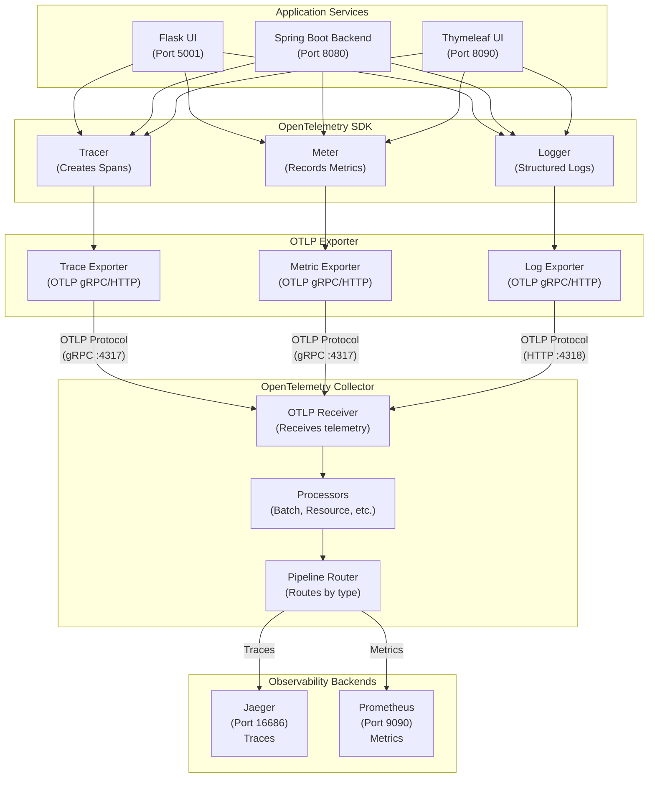
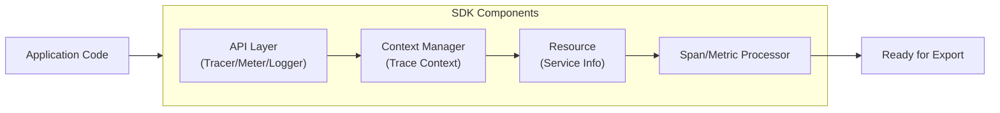
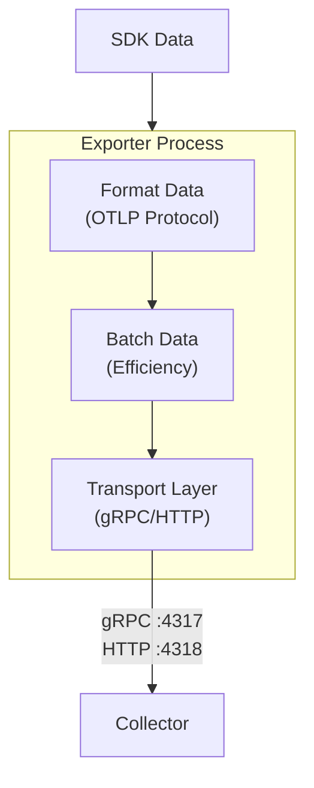
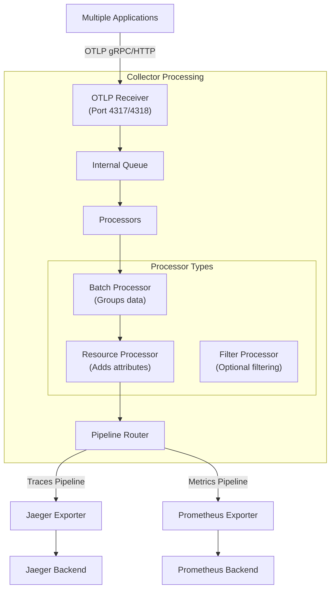
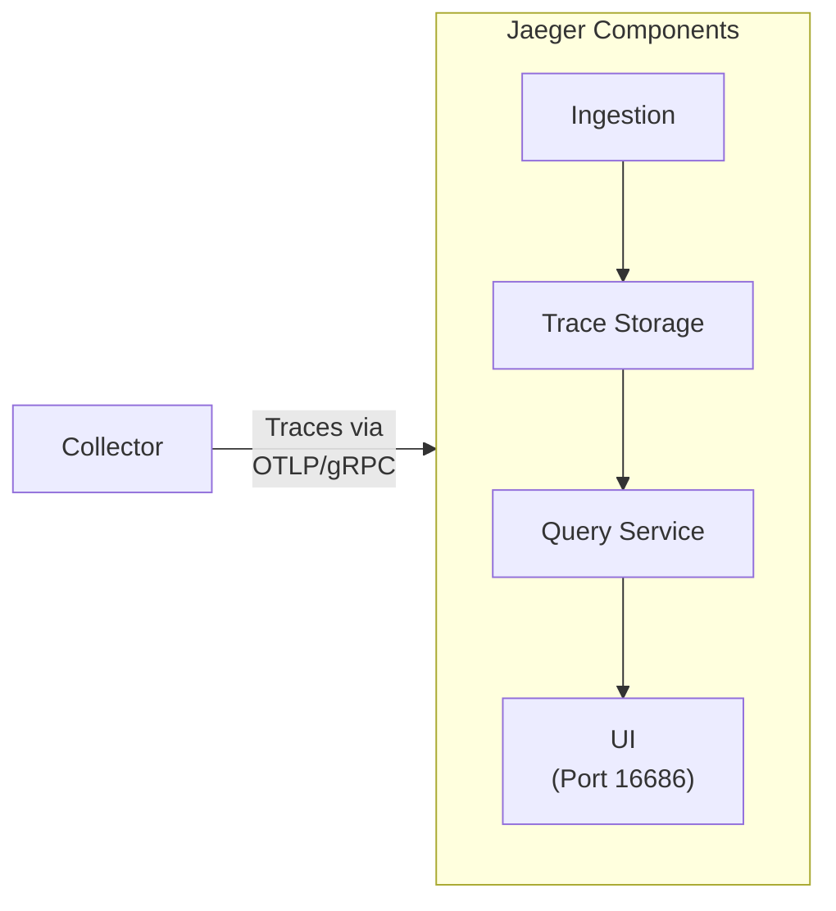
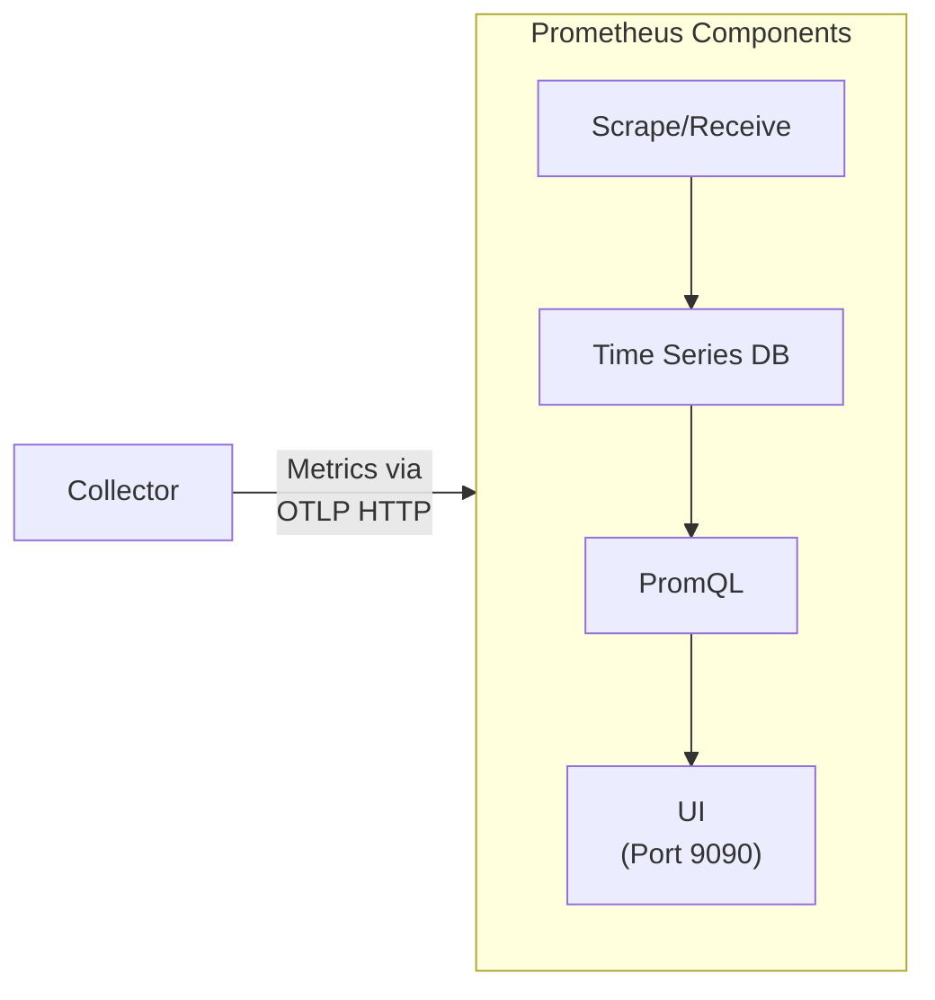
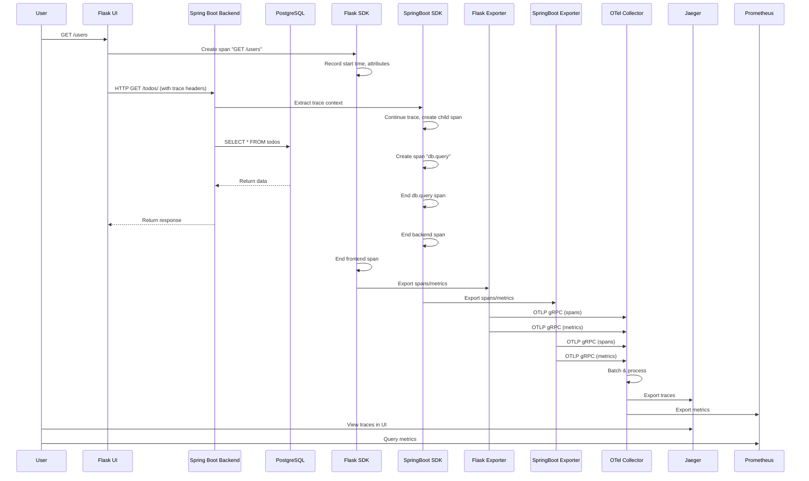

# Telemetry Data Flow: Detailed Visual Explanation

This document provides a comprehensive visual explanation of the telemetry data flow from Application → OTLP Exporter → Collector → Backends (Jaeger/Prometheus).

## High-Level Flow Diagram



## Step-by-Step Breakdown

### Step 1: Application Code Generates Telemetry

**What happens:**
- Application code executes (HTTP requests, database queries, etc.)
- OpenTelemetry SDK instruments the code automatically or manually

**Example - Trace Creation:**
```python
# In Flask application
@app.route("/users")
def get_user():
    # SDK automatically creates a span for this HTTP request
    # OR manually:
    with tracer.start_as_current_span("get_user") as span:
        span.set_attribute("user.id", 123)
        # ... business logic ...
```

**Example - Metric Recording:**
```python
# SDK records metrics
counter.add(1, attributes={"http.route": "/users", "status": "200"})
latency_gauge.record(0.125, attributes={"operation": "get_user"})
```

### Step 2: OpenTelemetry SDK Processes Telemetry

**Internal SDK Processing:**



**What the SDK does:**
- **Traces**: Creates spans with timing, attributes, and relationships
- **Metrics**: Aggregates metric data points
- **Logs**: Correlates logs with trace context
- **Resource**: Attaches service metadata (service.name, version, etc.)
- **Context**: Manages trace context propagation

### Step 3: OTLP Exporter Sends Data

**OTLP Exporter Configuration:**



**Configuration Example:**
```python
# Python SDK Configuration
from opentelemetry.exporter.otlp.proto.grpc.trace_exporter import OTLPSpanExporter

otlp_exporter = OTLPSpanExporter(
    endpoint="http://otelcol:4317",  # Collector endpoint
    insecure=True  # For development
)

# Environment variables used:
# OTEL_EXPORTER_OTLP_ENDPOINT=http://otelcol:4317
# OTEL_EXPORTER_OTLP_TRACES_PROTOCOL=grpc
# OTEL_EXPORTER_OTLP_METRICS_PROTOCOL=grpc
```

**What gets sent:**
- **Traces**: Span data (name, start/end time, attributes, parent context)
- **Metrics**: Metric data points (counters, gauges, histograms)
- **Logs**: Log records with trace correlation

### Step 4: OpenTelemetry Collector Receives Data

**Collector Architecture:**



**Collector Configuration:**
```yaml
receivers:
  otlp:
    protocols:
      grpc:
        endpoint: 0.0.0.0:4317  # Receives gRPC
      http:
        endpoint: 0.0.0.0:4318  # Receives HTTP

processors:
  batch:
    timeout: 10s        # Wait up to 10s to batch
    send_batch_size: 1024  # Send batches of 1024
  resource:
    attributes:
      environment: "production"  # Add to all telemetry

exporters:
  jaeger:
    endpoint: jaeger:14250
  prometheus:
    endpoint: http://prometheus:9090/api/v1/otlp

service:
  pipelines:
    traces:
      receivers: [otlp]
      processors: [batch, resource]
      exporters: [jaeger]
    metrics:
      receivers: [otlp]
      processors: [batch, resource]
      exporters: [prometheus]
```

**What the Collector does:**
1. **Receives**: Accepts OTLP data from multiple applications
2. **Processes**: Batches, enriches, filters telemetry
3. **Routes**: Separates traces, metrics, logs into pipelines
4. **Exports**: Sends to appropriate backends

### Step 5: Backends Store and Visualize

**Jaeger (Traces):**



**Prometheus (Metrics):**



## Complete End-to-End Example

**Scenario: User requests `/users` endpoint**



## Data Transformation at Each Stage

### 1. Application → SDK:
```
Raw operation → Structured span/metric/log object
```

### 2. SDK → Exporter:
```
SDK object → OTLP protocol buffer format
```

### 3. Exporter → Collector:
```
OTLP protobuf → Network transmission (gRPC/HTTP)
```

### 4. Collector → Backend:
```
OTLP format → Backend-specific format (Jaeger/Prometheus)
```

## Key Points

1. **Asynchronous**: Export happens asynchronously; applications don't wait
2. **Batching**: Data is batched for efficiency
3. **Protocol**: OTLP (OpenTelemetry Protocol) is vendor-neutral
4. **Separation**: Collector separates concerns (receiving vs. routing)
5. **Scalability**: Collector can handle multiple applications
6. **Flexibility**: Can route to multiple backends simultaneously

## Network Flow Details

### Port Usage

- **4317**: OTLP gRPC receiver (standard port for traces/metrics)
- **4318**: OTLP HTTP receiver (alternative protocol)
- **16686**: Jaeger UI (trace visualization)
- **9090**: Prometheus UI (metrics visualization)

### Protocol Details

**OTLP gRPC (Port 4317):**
- Binary protocol over gRPC
- Efficient for high-volume telemetry
- Used for traces and metrics
- Lower latency than HTTP

**OTLP HTTP (Port 4318):**
- JSON/Protobuf over HTTP
- More firewall-friendly
- Used for logs and some metrics
- Easier to debug

### Service Communication

All services communicate over the `todonet` Docker bridge network:
- Services resolve each other by name (e.g., `otelcol`, `jaeger`, `prometheus`)
- Internal DNS handles name resolution
- No need for IP addresses

## Configuration Examples

### Python Application Configuration

```python
# Environment variables
OTEL_EXPORTER_OTLP_ENDPOINT=http://otelcol:4317
OTEL_EXPORTER_OTLP_TRACES_PROTOCOL=grpc
OTEL_EXPORTER_OTLP_METRICS_PROTOCOL=grpc
OTEL_RESOURCE_ATTRIBUTES=service.name=todoui-flask,service.version=1.0.0
OTEL_METRICS_EXPORTER=otlp
```

### Java/Spring Boot Configuration

```properties
# application.properties
otel.exporter.otlp.endpoint=http://otelcol:4317
otel.exporter.otlp.protocol=grpc
otel.resource.attributes=service.name=todobackend-springboot
```

### Docker Compose Environment Variables

```yaml
environment:
  - OTEL_EXPORTER_OTLP_ENDPOINT=http://otelcol:4317
  - OTEL_EXPORTER_OTLP_TRACES_PROTOCOL=grpc
  - OTEL_EXPORTER_OTLP_METRICS_PROTOCOL=grpc
  - OTEL_RESOURCE_ATTRIBUTES=service.name=todobackend-springboot
  - OTEL_METRICS_EXPORTER=otlp,logging-otlp
  - OTEL_LOGS_EXPORTER=none
```

## Troubleshooting Flow

If telemetry isn't appearing in backends, check each stage:

1. **Application**: Is SDK initialized? Are spans/metrics being created?
2. **Exporter**: Is endpoint correct? Is protocol matching?
3. **Network**: Can application reach collector? Check Docker network.
4. **Collector**: Is collector receiving data? Check logs.
5. **Backend**: Is exporter configured correctly? Check collector config.

## Related Documentation

- See `techContext.md` for technology stack details
- See `systemPatterns.md` for architecture patterns
- See `projectbrief.md` for overall repository context

