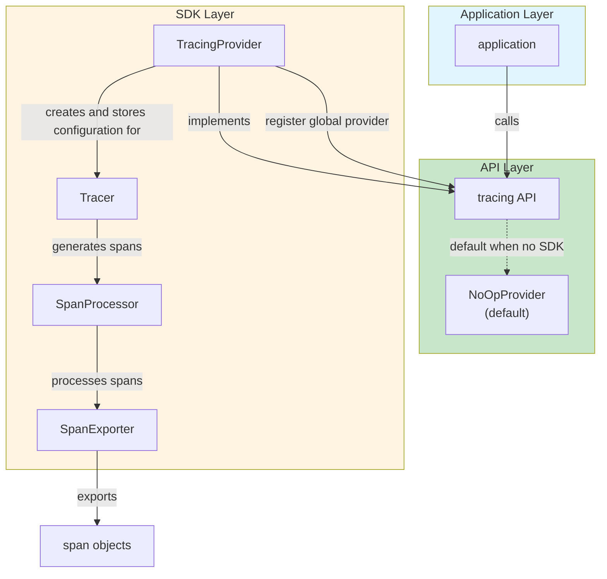
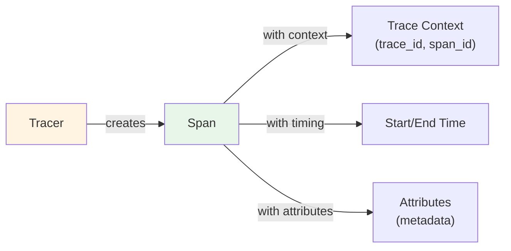
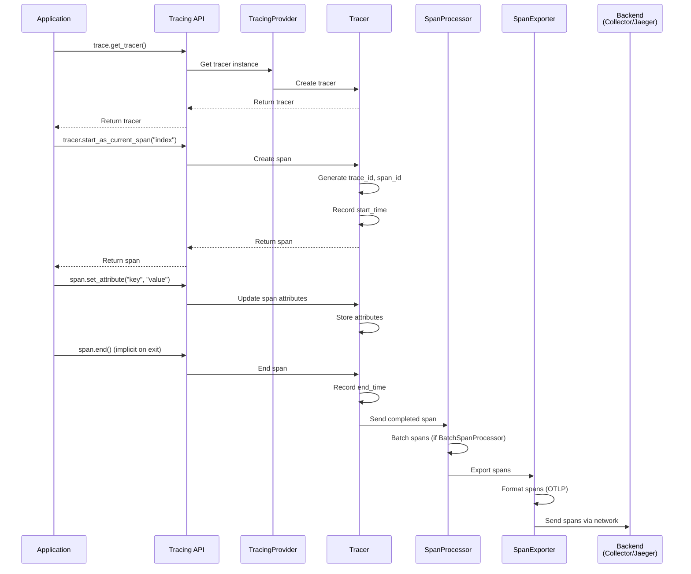
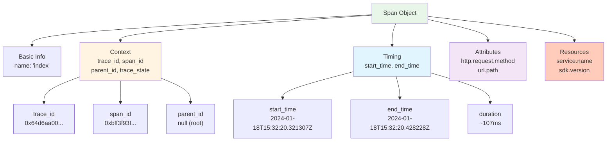
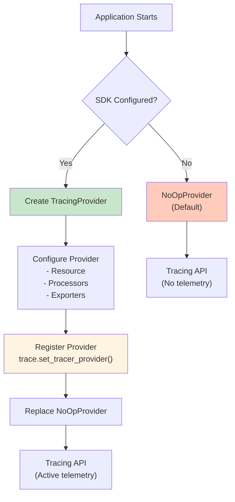
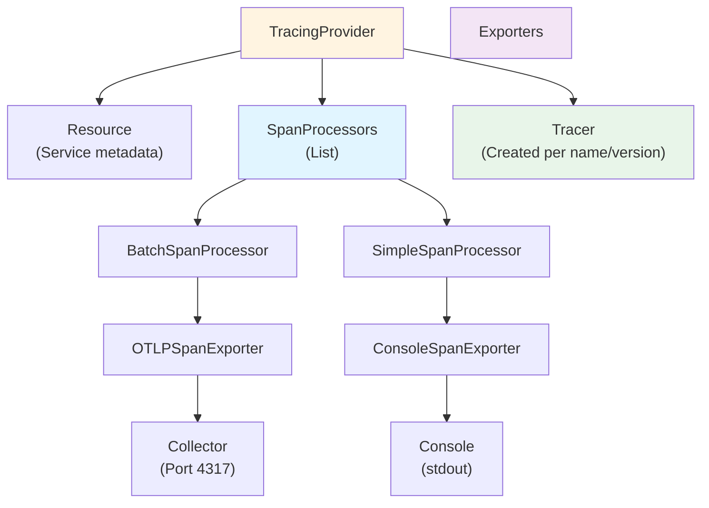

# Tracing Architecture: Producing Telemetry

> **Overview**: This document explains the architecture for producing telemetry, specifically tracing data, within an application using the OpenTelemetry SDK. It details how applications interact with the tracing API and SDK to generate, process, and export spans.

## Introduction

The "producing telemetry" architecture demonstrates how an application generates tracing data through a three-layer system: **Application Layer**, **API Layer**, and **SDK Layer**. This architecture ensures that telemetry generation is decoupled from the application code, allowing for flexible instrumentation and export strategies.

### Key Concepts

- **Application**: Your code that needs to be observed
- **Tracing API**: The interface your application calls to create traces
- **SDK**: The implementation that actually generates and processes telemetry
- **Spans**: The fundamental unit of tracing data, representing a single operation

## Three-Layer Architecture

The architecture consists of three distinct layers, each with specific responsibilities:



### Layer 1: Application Layer

**Purpose**: Your application code that needs observability.

**What it does**:
- Executes business logic
- Calls the tracing API to create spans
- Does not need to know about SDK implementation details

**Example**:
```python
from opentelemetry import trace

# Application code calls the API
tracer = trace.get_tracer("my-service")
with tracer.start_as_current_span("index") as span:
    span.set_attribute("http.request.method", "GET")
    span.set_attribute("url.path", "/")
    # ... your business logic ...
```

### Layer 2: API Layer

**Purpose**: Provides a stable interface for applications to create telemetry.

**Components**:

#### Tracing API
- **What it is**: The interface that applications call
- **Purpose**: Abstracts away SDK implementation details
- **Key Functions**:
  - `trace.get_tracer()` - Get a tracer instance
  - `tracer.start_as_current_span()` - Create a new span
  - `span.set_attribute()` - Add metadata to spans

#### NoOpProvider (Default)
- **What it is**: A no-operation provider that does nothing
- **When it's used**: When no SDK is configured
- **Purpose**: Prevents errors when SDK is not initialized
- **Behavior**: All API calls succeed but produce no telemetry

**Why NoOpProvider exists**:
- Allows libraries to call tracing API without checking if SDK is configured
- Prevents crashes when OpenTelemetry is not set up
- Enables gradual adoption of observability

```python
# Without SDK configured, NoOpProvider is used
from opentelemetry import trace

tracer = trace.get_tracer("my-service")
# This works but produces no telemetry
with tracer.start_as_current_span("operation"):
    pass  # No spans are actually created
```

### Layer 3: SDK Layer

**Purpose**: The actual implementation that generates, processes, and exports telemetry.

**Components**:

#### TracingProvider
- **What it is**: The SDK component that implements the tracing API
- **Responsibilities**:
  - Implements the tracing API interface
  - Registers itself as the global provider
  - Creates and manages Tracer instances
  - Stores configuration (resource attributes, processors, exporters)

**How it works**:
```python
from opentelemetry.sdk.trace import TracerProvider
from opentelemetry import trace

# Create provider
provider = TracerProvider(resource=resource)

# Register as global provider (replaces NoOpProvider)
trace.set_tracer_provider(provider)

# Now API calls use this provider
tracer = trace.get_tracer("my-service")  # Gets tracer from provider
```

#### Tracer
- **What it is**: Created by TracingProvider, generates spans
- **Responsibilities**:
  - Creates spans with proper context
  - Stores configuration from TracingProvider
  - Manages span lifecycle (start, end, attributes)

**Span Generation Flow**:


#### SpanProcessor
- **What it is**: Processes spans before export
- **Responsibilities**:
  - Receives completed spans from Tracer
  - May batch spans for efficiency
  - May filter or transform spans
  - Passes spans to SpanExporter

**Types of SpanProcessors**:
- **BatchSpanProcessor**: Batches spans before export (more efficient)
- **SimpleSpanProcessor**: Exports spans immediately (lower latency)

**Example**:
```python
from opentelemetry.sdk.trace.export import BatchSpanProcessor

# Create processor
processor = BatchSpanProcessor(exporter)

# Add to provider
provider.add_span_processor(processor)
```

#### SpanExporter
- **What it is**: Exports spans to external systems
- **Responsibilities**:
  - Receives spans from SpanProcessor
  - Formats spans according to protocol
  - Sends spans to backend (collector, Jaeger, etc.)

**Types of SpanExporters**:
- **OTLPSpanExporter**: Exports via OTLP protocol (to collector)
- **ConsoleSpanExporter**: Exports to console (for debugging)
- **JaegerExporter**: Exports directly to Jaeger

**Example**:
```python
from opentelemetry.exporter.otlp.proto.grpc.trace_exporter import OTLPSpanExporter

# Create exporter
exporter = OTLPSpanExporter(
    endpoint="http://otelcol:4317",
    insecure=True
)

# Use with processor
processor = BatchSpanProcessor(exporter)
```

## Complete Data Flow

Here's how data flows through the entire system:



### Step-by-Step Flow

1. **Application calls API**: `tracer.start_as_current_span("index")`
2. **API delegates to Provider**: Gets tracer from TracingProvider
3. **Tracer creates span**: Generates trace context, records start time
4. **Application adds attributes**: `span.set_attribute("http.request.method", "GET")`
5. **Span completes**: When context exits, span is ended
6. **Tracer sends to Processor**: Completed span is passed to SpanProcessor
7. **Processor batches**: Spans are batched for efficiency (if using BatchSpanProcessor)
8. **Processor sends to Exporter**: Batched spans are sent to SpanExporter
9. **Exporter formats and sends**: Spans are formatted (OTLP) and sent to backend

## Span Structure

A span is the fundamental unit of tracing data. Here's the structure of a span as shown in the architecture diagram:

### Span JSON Structure

```json
{
  "name": "index",
  "context": {
    "trace_id": "0x64d6aa00b229557023afb032160c9237",
    "span_id": "0xbff3f93fb12ff4ac",
    "trace_state": "[]"
  },
  "parent_id": null,
  "start_time": "2024-01-18T15:32:20.321307Z",
  "end_time": "2024-01-18T15:32:20.428228Z",
  "attributes": {
    "http.request.method": "GET",
    "url.path": "/"
  },
  "resources": {
    "attributes": {
      "telemetry.sdk.language": "python",
      "telemetry.sdk.name": "opentelemetry",
      "telemetry.sdk.version": "1.24.0",
      "service.name": "unknown_service"
    }
  }
}
```

### Field Explanations

#### Basic Fields

- **`name`**: The name of the operation (e.g., "index", "get_user", "db.query")
  - Should be descriptive and follow naming conventions
  - Example: `"index"` for the root operation

#### Context Fields

- **`context.trace_id`**: Unique identifier for the entire trace
  - Format: Hexadecimal string (32 hex digits = 128 bits)
  - All spans in the same trace share the same trace_id
  - Example: `"0x64d6aa00b229557023afb032160c9237"`

- **`context.span_id`**: Unique identifier for this specific span
  - Format: Hexadecimal string (16 hex digits = 64 bits)
  - Each span has a unique span_id
  - Example: `"0xbff3f93fb12ff4ac"`

- **`context.trace_state`**: Additional trace context (usually empty)
  - Format: String representation of key-value pairs
  - Used for vendor-specific trace metadata
  - Example: `"[]"` (empty)

- **`parent_id`**: The span_id of the parent span (if any)
  - `null` for root spans (no parent)
  - Contains parent span_id for child spans
  - Creates the trace tree structure

#### Timing Fields

- **`start_time`**: When the operation started
  - Format: ISO 8601 timestamp with nanoseconds
  - Example: `"2024-01-18T15:32:20.321307Z"`

- **`end_time`**: When the operation completed
  - Format: ISO 8601 timestamp with nanoseconds
  - Duration = end_time - start_time
  - Example: `"2024-01-18T15:32:20.428228Z"` (duration: ~107ms)

#### Attributes

- **`attributes`**: Key-value pairs describing the operation
  - Follow semantic conventions (e.g., `http.request.method`, `url.path`)
  - Can include custom attributes
  - Examples:
    - `"http.request.method": "GET"` - HTTP method
    - `"url.path": "/"` - Request path

#### Resources

- **`resources.attributes`**: Metadata about the service/environment
  - Applied to all spans from this service
  - Includes SDK information and service identification
  - Examples:
    - `"telemetry.sdk.language": "python"` - Programming language
    - `"telemetry.sdk.name": "opentelemetry"` - SDK name
    - `"telemetry.sdk.version": "1.24.0"` - SDK version
    - `"service.name": "unknown_service"` - Service name (should be configured!)

### Visual Span Structure



## Component Relationships

### Provider Registration Flow



### Configuration Flow



## Practical Examples

### Example 1: Basic Setup (From LFS148 Codebase)

This example shows how the architecture is used in practice:

```python
from opentelemetry import trace
from opentelemetry.sdk.trace import TracerProvider
from opentelemetry.sdk.trace.export import BatchSpanProcessor, ConsoleSpanExporter
from opentelemetry.sdk.resources import Resource

# Step 1: Create resource (metadata about service)
resource = Resource.create({
    "service.name": "my-service",
    "service.version": "1.0.0"
})

# Step 2: Create exporter
exporter = ConsoleSpanExporter()

# Step 3: Create processor
processor = BatchSpanProcessor(exporter)

# Step 4: Create provider
provider = TracerProvider(resource=resource)

# Step 5: Add processor to provider
provider.add_span_processor(processor)

# Step 6: Register provider (replaces NoOpProvider)
trace.set_tracer_provider(provider)

# Step 7: Application uses API
tracer = trace.get_tracer("my-service", "1.0.0")

# Step 8: Create spans
with tracer.start_as_current_span("index") as span:
    span.set_attribute("http.request.method", "GET")
    span.set_attribute("url.path", "/")
    # Business logic here
```

### Example 2: OTLP Exporter Setup

Exporting to OpenTelemetry Collector:

```python
from opentelemetry import trace
from opentelemetry.sdk.trace import TracerProvider
from opentelemetry.sdk.trace.export import BatchSpanProcessor
from opentelemetry.exporter.otlp.proto.grpc.trace_exporter import OTLPSpanExporter
from opentelemetry.sdk.resources import Resource

# Create resource
resource = Resource.create({
    "service.name": "todobackend",
    "service.version": "1.0.0"
})

# Create OTLP exporter (sends to collector)
otlp_exporter = OTLPSpanExporter(
    endpoint="http://otelcol:4317",
    insecure=True
)

# Create processor
processor = BatchSpanProcessor(otlp_exporter)

# Create and register provider
provider = TracerProvider(resource=resource)
provider.add_span_processor(processor)
trace.set_tracer_provider(provider)

# Use tracer
tracer = trace.get_tracer("todobackend", "1.0.0")
```

### Example 3: Multiple Processors

Using multiple processors for different export destinations:

```python
from opentelemetry.sdk.trace import TracerProvider
from opentelemetry.sdk.trace.export import BatchSpanProcessor, SimpleSpanProcessor
from opentelemetry.exporter.otlp.proto.grpc.trace_exporter import OTLPSpanExporter
from opentelemetry.exporter.console import ConsoleSpanExporter

provider = TracerProvider()

# Processor 1: Export to collector (batched)
otlp_exporter = OTLPSpanExporter(endpoint="http://otelcol:4317")
batch_processor = BatchSpanProcessor(otlp_exporter)
provider.add_span_processor(batch_processor)

# Processor 2: Export to console (immediate, for debugging)
console_exporter = ConsoleSpanExporter()
simple_processor = SimpleSpanProcessor(console_exporter)
provider.add_span_processor(simple_processor)

trace.set_tracer_provider(provider)
```

## Key Takeaways

1. **Three-Layer Separation**: Application → API → SDK provides clean separation of concerns
2. **NoOpProvider Safety**: Default provider prevents errors when SDK isn't configured
3. **Provider Registration**: TracingProvider must be registered to replace NoOpProvider
4. **Processor Pipeline**: Spans flow: Tracer → SpanProcessor → SpanExporter
5. **Batching**: BatchSpanProcessor improves efficiency by batching spans
6. **Resource Attributes**: Applied to all spans from a service
7. **Span Structure**: Rich metadata including context, timing, attributes, and resources

## Relationship to Other Documentation

- **`architecture/openTelemetryArchitecture.md`**: Explains the overall OpenTelemetry architecture (Specification, SDK, API)
- **`architecture/telemetryDataFlow.md`**: Shows how telemetry flows from applications to backends
- **`systemPatterns.md`**: Documents patterns used in the LFS148 codebase

## Next Steps

After understanding this architecture:

1. **Explore Manual Instrumentation**: See `exercises/manual-instrumentation-traces/` for practical examples
2. **Understand Collector Integration**: See `exercises/collector/` for how spans are exported
3. **Review Auto-Instrumentation**: See `exercises/automatic-instrumentation/` for zero-code approaches
4. **Study Span Structure**: Experiment with adding attributes and understanding trace context

---

**Remember**: This architecture ensures that your application code remains decoupled from telemetry implementation details, allowing you to change exporters, processors, and configuration without modifying your business logic!

