# Auto-Instrumentation Visual Guide: Java Deep Dive

> **A comprehensive guide explaining Java auto-instrumentation at beginner, intermediate, and advanced levels**

## Table of Contents

1. [Introduction & Overview](#introduction--overview)
2. [Beginner Level - Understanding the Concept](#beginner-level---understanding-the-concept)
3. [Intermediate Level - How It Works](#intermediate-level---how-it-works)
4. [Advanced Level - Bytecode Manipulation Deep-Dive](#advanced-level---bytecode-manipulation-deep-dive)
5. [Practical Examples from LFS148 Project](#practical-examples-from-lfs148-project)
6. [Benefits and Challenges Summary](#benefits-and-challenges-summary)

---

## Introduction & Overview

### What is Auto-Instrumentation?

Auto-instrumentation is a powerful technique that **automatically adds observability code to your application without requiring you to modify your source code**. Think of it as having an invisible assistant that watches your application and automatically collects information about its behavior.

**In simple terms**: Auto-instrumentation uses special tools (called "agents" in Java) that modify your application's code as it runs, injecting instrumentation logic that captures traces, metrics, and logs automatically.

### Why Use Auto-Instrumentation?

Auto-instrumentation simplifies observability setup by:

- **Zero Code Changes**: No need to modify your application source code
- **Automatic Framework Support**: Automatically instruments popular frameworks (Spring Boot, HTTP clients, databases, etc.)
- **Consistent Instrumentation**: Ensures all applications follow the same instrumentation patterns
- **Quick Setup**: Get observability running in minutes instead of days

### Challenges and Limitations

While powerful, auto-instrumentation has some limitations:

- **Language Support**: Not all languages support similar mechanisms (Java's bytecode manipulation is unique)
- **Performance Overhead**: Adds some runtime overhead (typically minimal)
- **Debugging Complexity**: Can make debugging more complex when issues arise
- **Limited Customization**: May not capture all custom business logic without manual instrumentation

### Comparison: Manual vs Auto-Instrumentation


---

## Beginner Level - Understanding the Concept

### Analogy: The Invisible Helper

Imagine you're watching a movie in a foreign language. **Manual instrumentation** is like manually adding subtitles to every scene yourself - it's precise but time-consuming. **Auto-instrumentation** is like having an automatic subtitle generator that watches the movie and adds subtitles in real-time without you doing anything.

In Java applications:
- **Your Application** = The movie
- **Java Agent** = The automatic subtitle generator
- **Bytecode** = The film reel (the compiled code)
- **Instrumentation** = The subtitles (observability data)

### What Happens at Runtime?

When you run a Java application with auto-instrumentation:

1. **You start your application** with a special flag: `-javaagent:agent.jar`
2. **The Java Virtual Machine (JVM) loads the agent** before your application starts
3. **The agent registers itself** to watch for classes being loaded
4. **When classes load**, the agent intercepts them and adds instrumentation code
5. **Your application runs normally**, but now it automatically collects observability data

### Visual Flow: Application to Instrumentation

```mermaid
flowchart TD
    Start["🚀 Start Application<br/>java -javaagent:agent.jar MyApp"]
    
    subgraph JVM["Java Virtual Machine"]
        LoadAgent["Load Java Agent<br/>(premain method)"]
        RegisterTransformer["Register ClassFileTransformer"]
    end
    
    subgraph App["Your Application"]
        LoadClass["Load Class<br/>(e.g., HTTP Handler)"]
        Transform["Transform Bytecode<br/>(Add instrumentation)"]
        Execute["Execute Instrumented Code"]
    end
    
    subgraph Observability["Observability"]
        Collect["Collect Traces/Metrics"]
        Export["Export to Collector"]
    end
    
    Start --> LoadAgent
    LoadAgent --> RegisterTransformer
    RegisterTransformer --> LoadClass
    LoadClass --> Transform
    Transform --> Execute
    Execute --> Collect
    Collect --> Export
    
    style Start fill:#e1f5ff
    style JVM fill:#fff4e1
    style App fill:#e8f5e9
    style Observability fill:#f3e5f5
```



### Key Concepts Explained Simply

**Java Agent**
- A special JAR file that can modify classes before they're loaded
- Think of it as a "code modifier" that runs alongside your application

**JVM (Java Virtual Machine)**
- The runtime environment that executes Java code
- Provides hooks for agents to intercept class loading

**Bytecode**
- The compiled form of Java code (`.class` files)
- Like assembly language, but for the JVM
- Can be modified before execution

**Class Loading**
- The process of reading `.class` files and preparing them for execution
- Agents intercept this process to modify classes

---

## Intermediate Level - How It Works

### Java Agent Mechanism

Java provides two entry points for agents:

1. **`premain`**: Called before the main method runs (most common)
2. **`agentmain`**: Called after the application has started (for attaching to running processes)

### The premain Method

The `premain` method is the entry point for Java agents. Here's how it works:

```java
public class MyAgent {
    public static void premain(String agentArgs, Instrumentation inst) {
        // Register a transformer that will modify classes
        inst.addTransformer(new MyTransformer());
    }
}
```

**Parameters**:
- `agentArgs`: Command-line arguments passed to the agent
- `inst`: The `Instrumentation` object that provides access to class loading

### ClassFileTransformer Interface

The `ClassFileTransformer` interface is where the magic happens. It receives bytecode and can return modified bytecode:

```java
public class MyTransformer implements ClassFileTransformer {
    @Override
    public byte[] transform(
            ClassLoader loader,
            String className,
            Class<?> classBeingRedefined,
            ProtectionDomain protectionDomain,
            byte[] classfileBuffer
    ) {
        // Analyze the class name
        if (!shouldInstrument(className)) {
            return null; // Don't modify this class
        }
        
        // Perform bytecode transformation
        byte[] modifiedBytecode = modifyBytecode(classfileBuffer);
        
        // Return the modified bytecode
        return modifiedBytecode;
    }
}
```

**Key Points**:
- Returns `null` if the class shouldn't be modified
- Returns modified bytecode array if transformation is needed
- Can use libraries like Byte Buddy or ASM to manipulate bytecode

### Step-by-Step Process Flow


### OpenTelemetry Java Agent

The OpenTelemetry Java Agent (`opentelemetry-javaagent.jar`) is a production-ready agent that:

- **Automatically instruments** hundreds of popular Java libraries
- **Uses Byte Buddy** for bytecode manipulation
- **Requires zero code changes** to your application
- **Configurable via environment variables**

### Configuration Example

From the LFS148 project Dockerfile:

```21:23:exercises/automatic-instrumentation/initial/todobackend-springboot/Dockerfile
ADD https://github.com/open-telemetry/opentelemetry-java-instrumentation/releases/download/v2.8.0/opentelemetry-javaagent.jar /opt/todobackend

ENTRYPOINT ["java", "-cp", "/opt/todobackend/app:/opt/todobackend/app/lib/*",  "-javaagent:/opt/todobackend/opentelemetry-javaagent.jar","io.novatec.todobackend.TodobackendApplication"]
```

**Key Configuration**:
- `-javaagent:/opt/todobackend/opentelemetry-javaagent.jar`: Specifies the agent JAR
- Environment variables configure the agent (exporters, endpoints, etc.)

### How OpenTelemetry Agent Works Internally


---

## Advanced Level - Bytecode Manipulation Deep-Dive

### Bytecode Fundamentals

**What is Bytecode?**

Bytecode is the intermediate representation of Java code. When you compile a Java file (`.java`), it becomes bytecode (`.class`). The JVM executes bytecode, not your original source code.

**Example**: A simple method in Java:
```java
public String greet(String name) {
    return "Hello, " + name;
}
```

Becomes bytecode (simplified representation):
```
aload_1          // Load parameter 'name'
ldc "Hello, "    // Load constant string
invokevirtual    // Call String.concat
areturn          // Return result
```

### How Bytecode Manipulation Works

Bytecode manipulation involves:

1. **Parsing**: Reading the bytecode structure
2. **Analysis**: Understanding what the code does
3. **Modification**: Adding new instructions
4. **Generation**: Creating new bytecode

### Byte Buddy: The Power Behind OpenTelemetry Agent

Byte Buddy is a library that simplifies bytecode manipulation. The OpenTelemetry Java Agent uses Byte Buddy extensively.

**Why Byte Buddy?**
- High-level API (easier than raw bytecode manipulation)
- Excellent performance
- Handles complex scenarios (inheritance, interfaces, etc.)

**Note**: In the LFS148 project, Byte Buddy is excluded from test dependencies to avoid conflicts:

```62:68:exercises/automatic-instrumentation/initial/todobackend-springboot/pom.xml
                <exclusion>
                    <groupId>net.bytebuddy</groupId>
                    <artifactId>byte-buddy</artifactId>
                </exclusion>
                <exclusion>
                    <groupId>net.bytebuddy</groupId>
                    <artifactId>byte-buddy-agent</artifactId>
                </exclusion>
```

### Class Loading and Transformation Process


### Detailed Transformation Flow

Here's what happens when a class is transformed:


### Example: Transforming a Method

**Original Method** (conceptual):
```java
@GetMapping("/todos/")
List<String> getTodos() {
    List<String> todos = new ArrayList<>();
    todoRepository.findAll().forEach(todo -> todos.add(todo.getTodo()));
    return todos;
}
```

**After Transformation** (conceptual):
```java
@GetMapping("/todos/")
List<String> getTodos() {
    Span span = tracer.startSpan("GET /todos/");  // Added by agent
    try {
        span.setAttribute("http.method", "GET");  // Added by agent
        span.setAttribute("http.route", "/todos/");  // Added by agent
        
        List<String> todos = new ArrayList<>();
        todoRepository.findAll().forEach(todo -> todos.add(todo.getTodo()));
        
        span.setStatus(StatusCode.OK);  // Added by agent
        return todos;
    } catch (Exception e) {
        span.recordException(e);  // Added by agent
        span.setStatus(StatusCode.ERROR);  // Added by agent
        throw e;
    } finally {
        span.end();  // Added by agent
    }
}
```

### Performance Considerations

**Overhead Sources**:
1. **Class Loading**: Slight delay during initial class loading
2. **Bytecode Size**: Instrumented classes are larger
3. **Runtime**: Minimal overhead from span creation/recording

**Optimization Techniques**:
- **Lazy Loading**: Only instrument classes when needed
- **Caching**: Cache transformed bytecode
- **Selective Instrumentation**: Only instrument relevant classes/methods

### Security Implications

**What Agents Can Do**:
- Read any class bytecode
- Modify any class bytecode
- Access class metadata
- Potentially bypass security checks

**Security Best Practices**:
- Only use agents from trusted sources
- Verify agent JAR signatures
- Use security policies to restrict agent capabilities
- Monitor agent behavior in production

---

## Practical Examples from LFS148 Project

### Spring Boot Application Auto-Instrumentation

The LFS148 project demonstrates auto-instrumentation with a Spring Boot application. Let's examine how it works:

#### Application Code

The application code requires **zero modifications** for auto-instrumentation:

```44:68:exercises/automatic-instrumentation/initial/todobackend-springboot/src/main/java/io/novatec/todobackend/TodobackendApplication.java
	@GetMapping("/hello")
	String hello() {

		return getInstanceId() + " Hallo, Welt ! ";

	}

	@GetMapping("/fail")
	String fail() {

		System.exit(1);
		return "fixed!";
	}

	@GetMapping("/todos/")
	List<String> getTodos(){

		List<String> todos = new ArrayList<String>();

		todoRepository.findAll().forEach(todo -> todos.add(todo.getTodo()));
		logger.info("GET /todos/ "+todos.toString());


		return todos;
	}
```

**Notice**: No OpenTelemetry imports or SDK calls needed!

#### Dockerfile Configuration

The Dockerfile shows how to add the agent:

```21:23:exercises/automatic-instrumentation/initial/todobackend-springboot/Dockerfile
ADD https://github.com/open-telemetry/opentelemetry-java-instrumentation/releases/download/v2.8.0/opentelemetry-javaagent.jar /opt/todobackend

ENTRYPOINT ["java", "-cp", "/opt/todobackend/app:/opt/todobackend/app/lib/*",  "-javaagent:/opt/todobackend/opentelemetry-javaagent.jar","io.novatec.todobackend.TodobackendApplication"]
```

**Key Points**:
- Downloads the OpenTelemetry Java Agent JAR
- Uses `-javaagent:` flag to attach the agent
- No code changes required

#### What Gets Instrumented Automatically

With the OpenTelemetry Java Agent, the following are automatically instrumented:

1. **HTTP Requests**: All `@GetMapping`, `@PostMapping`, etc. endpoints
2. **Database Calls**: JPA/Hibernate queries to the database
3. **HTTP Client**: Outgoing HTTP requests (if any)
4. **Spring Framework**: Spring MVC, Spring Boot Actuator

### Environment Variable Configuration

The agent can be configured via environment variables:

```bash
# OTLP Exporter Configuration
OTEL_EXPORTER_OTLP_ENDPOINT=http://otel-collector:4317
OTEL_EXPORTER_OTLP_PROTOCOL=grpc

# Service Information
OTEL_SERVICE_NAME=todobackend
OTEL_SERVICE_VERSION=1.0.0

# Resource Attributes
OTEL_RESOURCE_ATTRIBUTES=deployment.environment=production

# Instrumentation Configuration
OTEL_INSTRUMENTATION_HTTP_ENABLED=true
OTEL_INSTRUMENTATION_JDBC_ENABLED=true
```

### Real-World Instrumentation Example

When a request hits `/todos/`, the agent automatically:

1. **Creates a span** for the HTTP request
2. **Adds attributes**: `http.method=GET`, `http.route=/todos/`, `http.status_code=200`
3. **Instruments the database call**: Creates a child span for `findAll()`
4. **Records timing**: Captures duration of the entire operation
5. **Exports telemetry**: Sends traces to the configured OTLP endpoint

All of this happens **without modifying the source code**!

---

## Benefits and Challenges Summary

### Benefits of Auto-Instrumentation

#### 1. Zero Code Changes
- **No SDK imports** needed in your code
- **No manual span creation**
- **No context propagation** code
- Your code stays clean and focused on business logic

#### 2. Automatic Framework Support
- **Hundreds of libraries** automatically instrumented
- **Consistent patterns** across all applications
- **Framework updates** automatically supported

#### 3. Quick Setup
- **Minutes to setup** vs days for manual instrumentation
- **Consistent configuration** across teams
- **Reduced onboarding time** for new developers

#### 4. Maintenance-Free
- **Agent updates** bring new instrumentation automatically
- **No code changes** needed when adding new frameworks
- **Less code to maintain**

### Challenges and Limitations

#### 1. Language Support Varies

```mermaid
flowchart LR
    subgraph Support["Language Support"]
        Java["Java<br/>✅ Excellent<br/>Bytecode Manipulation"]
        Python["Python<br/>✅ Good<br/>Import Hooks"]
        Go["Go<br/>⚠️ Limited<br/>No Runtime Modification"]
        Rust["Rust<br/>❌ None<br/>Compiled Binary"]
    end
    
    style Java fill:#e8f5e9
    style Python fill:#fff4e1
    style Go fill:#fff4e1
    style Rust fill:#ffebee
```


**Java** has the best support due to bytecode manipulation capabilities.

#### 2. Performance Overhead
- **Class loading**: Slight delay during startup
- **Runtime**: Minimal overhead (~1-5% typically)
- **Memory**: Increased memory usage for instrumented classes

#### 3. Debugging Complexity
- **Stack traces** may show agent-generated code
- **Breakpoints** may not work as expected
- **Error messages** can be confusing

#### 4. Limited Customization
- **Business logic** may not be automatically captured
- **Custom attributes** require manual instrumentation
- **Complex scenarios** may need manual spans

### Comparison: When to Use What?

```mermaid
flowchart TD
    Start["Need Observability?"]
    Start --> Decision{"Framework<br/>Support?"}
    
    Decision -->|"Standard Frameworks"| Auto["✅ Auto-Instrumentation<br/>- Quick setup<br/>- Zero code changes<br/>- Standard patterns"]
    
    Decision -->|"Custom Logic"| Manual["✅ Manual Instrumentation<br/>- Full control<br/>- Custom attributes<br/>- Business context"]
    
    Decision -->|"Both"| Hybrid["✅ Hybrid Approach<br/>- Auto for frameworks<br/>- Manual for business logic"]
    
    style Auto fill:#e8f5e9
    style Manual fill:#fff4e1
    style Hybrid fill:#e1f5ff
```



### Decision Matrix

| Scenario | Recommendation | Reason |
|----------|---------------|--------|
| Standard web application | Auto-instrumentation | Covers HTTP, database, frameworks |
| Custom business logic | Manual + Auto | Auto for frameworks, manual for business |
| High-performance critical path | Manual | Minimize overhead |
| Legacy application | Auto-instrumentation | No code changes needed |
| New microservice | Auto-instrumentation | Quick setup, consistent patterns |

### Best Practices

1. **Start with Auto-Instrumentation**: Get observability quickly
2. **Add Manual Where Needed**: Enhance with custom spans for business logic
3. **Monitor Performance**: Watch for overhead in critical paths
4. **Keep Agent Updated**: New versions add more instrumentation
5. **Use Hybrid Approach**: Best of both worlds

---

## Conclusion

Auto-instrumentation in Java is a powerful technique that leverages bytecode manipulation to add observability without code changes. The OpenTelemetry Java Agent makes this accessible to everyone, automatically instrumenting hundreds of popular libraries.

**Key Takeaways**:
- **Java's bytecode manipulation** enables powerful auto-instrumentation
- **Zero code changes** required for standard frameworks
- **Quick setup** gets you observability in minutes
- **Language support varies** - Java has excellent support
- **Some overhead** exists but is typically minimal
- **Hybrid approach** (auto + manual) often works best

For more information, see:
- [OpenTelemetry Architecture Guide](architecture/openTelemetryArchitecture.md)
- [Telemetry Data Flow](architecture/telemetryDataFlow.md)
- [System Patterns](systemPatterns.md)

