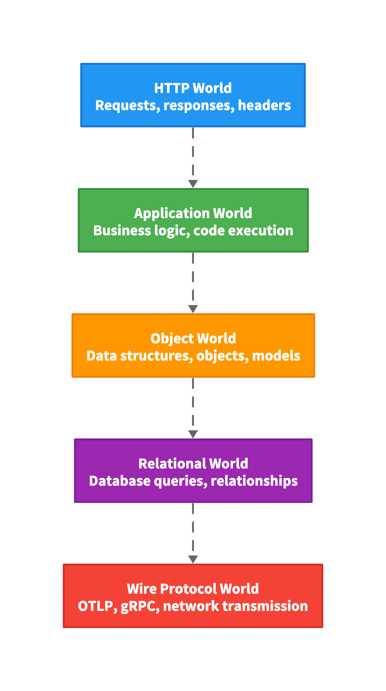

# OpenTelemetry Layers Infographic

A D2 diagram visualizing the vertical flow of telemetry data through five abstraction layers in OpenTelemetry, from HTTP requests down to wire protocol transmission.

## Overview

This infographic illustrates how observability data flows through different abstraction layers:

1. **HTTP World** - Requests, responses, headers
2. **Application World** - Business logic, code execution
3. **Object World** - Data structures, objects, models
4. **Relational World** - Database queries, relationships
5. **Wire Protocol World** - OTLP, gRPC, network transmission

## Files

- `telemetry-layers-infographic.d2` - D2 source file with vertical flow structure
- `telemetry-layers-infographic.svg` - Exported SVG from D2
- `telemetry-layers-infographic.png` - Exported PNG from D2
- `telemetry-layers-infographic.md` - This documentation file

## D2 Diagram Structure

The infographic uses D2's declarative syntax to create a vertical flow diagram:

```
direction: down

http_world: HTTP World {
  style: {
    fill: "#2196F3"
    stroke: "#1976D2"
    font-color: white
  }
  label: "HTTP World\nRequests, responses, headers"
}

http_world -> app_world: "" {
  style: {
    animated: true
  }
}
```

### Animation

D2 supports animated connections using `animated: true` in the connection style. The arrows will animate sequentially from top to bottom, showing the flow of data through the layers.

## Usage Instructions

### Viewing the Diagram

#### Option 1: D2 Playground (Online)

1. Visit [D2 Playground](https://play.d2lang.com/)
2. Copy the contents of `telemetry-layers-infographic.d2`
3. Paste into the playground
4. View the animated diagram in your browser

#### Option 2: D2 CLI (Local)

1. Install D2 CLI:

   ```bash
   brew install d2  # macOS
   # or visit https://d2lang.com/tour/install
   ```

2. View the diagram:

   ```bash
   d2 telemetry-layers-infographic.d2
   ```

3. Export to SVG:

   ```bash
   d2 telemetry-layers-infographic.d2 telemetry-layers-infographic.svg
   ```

4. Export to PNG:

   ```bash
   d2 telemetry-layers-infographic.d2 telemetry-layers-infographic.png
   ```

#### Option 3: VSCode/Cursor Extension (Recommended for Development)

The [Terrastruct D2 extension](https://marketplace.cursorapi.com/items/?itemName=Terrastruct.d2) provides seamless D2 diagram visualization directly in your editor with live preview and auto-refresh.

1. **Install the Extension**:
   - Open VSCode/Cursor
   - Go to Extensions (Cmd+Shift+X / Ctrl+Shift+X)
   - Search for "D2" by Terrastruct
   - Click Install
   - Or install directly: [Terrastruct.d2](https://marketplace.cursorapi.com/items/?itemName=Terrastruct.d2)

2. **View the Diagram**:
   - Open `telemetry-layers-infographic.d2` in the editor
   - Press **Cmd+Shift+D** (macOS) or **Ctrl+Shift+D** (Windows/Linux) to open the preview
   - The diagram will render automatically and update as you edit the D2 source

3. **Features**:
   - **Live Preview**: See changes instantly as you edit the D2 file
   - **Auto-refresh**: Diagram updates automatically when you save
   - **Side-by-side View**: Edit D2 source and preview diagram simultaneously
   - **Export Support**: Right-click in preview to export to SVG/PNG
   - **Syntax Highlighting**: Full D2 syntax support with IntelliSense

4. **Keyboard Shortcuts**:
   - **macOS**: `Cmd+Shift+D` - Open/close D2 preview
   - **Windows/Linux**: `Ctrl+Shift+D` - Open/close D2 preview
   - You can also use Command Palette (`Cmd+Shift+P` / `Ctrl+Shift+P`) and type "D2: Open Preview"

5. **Benefits**:
   - No need to install D2 CLI separately
   - Integrated development experience
   - Real-time visualization while editing
   - Perfect for iterative diagram design
   - Works seamlessly with version control

### Embedding in GitHub Pages

#### Using Exported SVG

1. Copy `telemetry-layers-infographic.svg` to your repository
2. Reference it in markdown:

```markdown

```

#### Using Exported PNG

```markdown

```

### Embedding in Blog Posts

#### Option 1: Direct SVG Embedding

```html

```

#### Option 2: PNG Image

```html

```

#### Option 3: D2 Source with Renderer

If your blog supports D2 rendering, embed the source:

```
direction: down
# ... D2 source code ...
```

### Embedding in Documentation

For Markdown documentation (GitHub, GitLab, etc.):

```markdown

```

## Design Principles

### Visual Hierarchy

- **Color Coding**: Each layer has a distinct color for easy identification
  - HTTP World: Blue (#2196F3)
  - Application World: Green (#4CAF50)
  - Object World: Orange (#FF9800)
  - Relational World: Purple (#9C27B0)
  - Wire Protocol World: Red (#F44336)

- **Spacing**: D2 automatically handles spacing between layers
- **Typography**: Large, readable text with white font on colored backgrounds
- **Direction**: Vertical flow (`direction: down`) for top-to-bottom data flow

### Styling Features

- **Fill Colors**: Distinct background colors for each layer
- **Stroke Colors**: Darker stroke colors for depth
- **Font Colors**: White text for high contrast
- **Animated Connections**: Arrows animate to show flow direction

## D2 Syntax Explanation

### Basic Structure

```
direction: down          # Sets vertical layout

node_name: Node Label { # Defines a node
  style: {              # Styling block
    fill: "#COLOR"      # Background color
    stroke: "#COLOR"    # Border color
    font-color: white   # Text color
  }
  label: "Title\nSubtitle"  # Multi-line label
}

node1 -> node2: "" {    # Connection
  style: {
    animated: true      # Animate the arrow
  }
}
```

### Key D2 Features Used

- **`direction: down`** - Vertical layout for top-to-bottom flow
- **Multi-line labels** - Using `\n` for titles and subtitles
- **Style blocks** - Custom colors, fonts, and appearance
- **Animated connections** - `animated: true` for arrow animations
- **Empty connection labels** - Using `""` for clean arrows

## Customization

### Changing Colors

Edit the `fill` and `stroke` values in the D2 source:

```
http_world: HTTP World {
  style: {
    fill: "#YOUR_COLOR"      # Change background
    stroke: "#YOUR_DARK"    # Change border
    font-color: white        # Change text color
  }
}
```

### Adding Icons

D2 supports icons from Terrastruct's icon library:

```
http_world: HTTP World {
  icon: https://icons.terrastruct.com/dev%2Fhttp.svg
  # ... rest of styling
}
```

### Modifying Layer Content

Update the `label` field:

```
http_world: HTTP World {
  label: "Your Title\nYour Subtitle"
}
```

### Adjusting Layout

Change the direction or add spacing:

```
direction: down
# Add padding or spacing adjustments in style blocks
```

## Export Options

### To SVG

```bash
d2 telemetry-layers-infographic.d2 telemetry-layers-infographic.svg
```

### To PNG

```bash
d2 telemetry-layers-infographic.d2 telemetry-layers-infographic.png
```

### To PDF

```bash
d2 telemetry-layers-infographic.d2 telemetry-layers-infographic.pdf
```

### Export Format Options

D2 CLI supports various export formats:

- SVG (vector, scalable)
- PNG (raster, high-resolution)
- PDF (document format)
- Other formats via D2 plugins

## D2 Installation

> **Note**: If you're using VSCode or Cursor, you can skip CLI installation and use the [Terrastruct D2 extension](https://marketplace.cursorapi.com/items/?itemName=Terrastruct.d2) instead. The extension provides live preview with `Cmd+Shift+D` (macOS) or `Ctrl+Shift+D` (Windows/Linux) and doesn't require separate CLI installation.

### Option 1: VSCode/Cursor Extension (Recommended)

Install the [Terrastruct D2 extension](https://marketplace.cursorapi.com/items/?itemName=Terrastruct.d2) from the marketplace. See [Option 3: VSCode/Cursor Extension](#option-3-vscodecursor-extension-recommended-for-development) above for details.

### Option 2: D2 CLI

#### macOS

```bash
brew install d2
```

#### Linux

```bash
# Download from https://github.com/terrastruct/d2/releases
# or use package manager
```

#### Windows

```bash
# Download from https://github.com/terrastruct/d2/releases
# or use package manager
```

#### Docker

```bash
docker run --rm -i terrastruct/d2:latest < telemetry-layers-infographic.d2 > output.svg
```

## Related Documentation

- `architecture/telemetryDataFlow.md` - Detailed explanation of telemetry data flow
- `architecture/openTelemetryArchitecture.md` - OpenTelemetry architecture overview
- `systemPatterns.md` - System architecture patterns

## D2 Language Documentation

For comprehensive D2 language reference and tutorials:

- **[D2 Official Documentation](https://d2lang.com/)** - Complete D2 language documentation
- **[D2 Tour](https://d2lang.com/tour/intro/)** - Interactive tutorial and language tour
- **[D2 Playground](https://play.d2lang.com/)** - Online editor to experiment with D2 syntax
- **[D2 GitHub Repository](https://github.com/terrastruct/d2)** - Source code, issues, and contributions
- **[D2 Installation Guide](https://d2lang.com/tour/install)** - Installation instructions for all platforms
- **[D2 Syntax Reference](https://d2lang.com/tour/)** - Complete syntax reference and examples
- **[D2 Examples](https://github.com/terrastruct/d2/tree/master/examples)** - Collection of example diagrams

## Credits

Created for the LFS148 OpenTelemetry exercise repository to visualize the abstraction layers through which observability data flows.

---

**Note**: This infographic uses D2, a declarative diagramming language that prioritizes clarity and simplicity. The diagram can be easily modified, version-controlled, and exported to multiple formats. D2's animated connections help visualize the flow of data through the abstraction layers.
